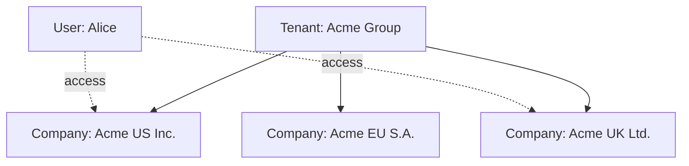

# Multi-Tenant / Company Switching

## Table of Contents
- [Concepts: tenant vs company](#concepts-tenant-vs-company)
- [How multi-company works for users](#how-multi-company-works-for-users)
- [Switching companies](#switching-companies)
- [Creating a new company](#creating-a-new-company)
- [Granting a user access to a company](#granting-a-user-access-to-a-company)
- [Cross-company restrictions](#cross-company-restrictions)
- [Reporting across companies](#reporting-across-companies)
- [Deactivating a company](#deactivating-a-company)
- [Common scenarios](#common-scenarios)
- [Pitfalls](#pitfalls)

## Concepts: tenant vs company

In ChuA.ERP:

| Term | Meaning |
|---|---|
| **Tenant** | A platform installation. Each tenant has its own database and user directory. |
| **Company** | A legal entity / accounting unit *inside* a tenant. A tenant can host several Companies. |

Companies are isolated from each other for data: vendors, customers,
journal entries, etc. all carry a Company id. A user with access to multiple
Companies switches between them; documents in one Company never leak into
another.

## How multi-company works for users

When you have access to more than one Company, the **top-right user menu**
gains a *Switch company* item:

`[SCREENSHOT: Switch company menu]`

The currently active Company is shown on your profile page. Every document
you create is automatically tagged with the active Company. Every list you
view is automatically filtered to the active Company.

## Switching companies

1. Click your name in the top-right corner.
2. Choose **Switch company**.
3. Pick the Company from the list.
4. The Dashboard reloads with the new Company's data.

> **Warning** — If you start a form in Company A, then switch to Company
> B before saving, the form is **lost**. Submit or cancel first, then
> switch.

> **Tip** — Confirm the active Company before posting anything financial.
> The environment badge in the top bar shows your environment (PROD /
> UAT / DEV); the user menu shows your active Company. Glance at both
> before high-impact actions.

## Creating a new company

> **Permission required** — `SystemAdmin`.

1. *Administration › Companies › New company*.
2. Fill the form:
   - Code (e.g. `ACME-UK`) — short, unique, immutable
   - Name (legal entity name)
   - Legal name / Tax id / Registration number
   - Base currency (immutable after first transaction)
   - Registered address (line 1/2, city, state, postal code, country code)
   - Phone / Email / Website (optional)
3. Click **Create**.

After creation, complete tenant setup:
- Define / copy the Chart of Accounts
- Configure fiscal periods (with platform team, until period admin UI ships)
- Set up workflow rules for the new Company
- Assign at least one Company Admin user

> **Warning** — Base currency cannot change once the Company has
> transactions. Get it right at creation.

## Granting a user access to a company

> **Permission required** — `SystemAdmin` to add a new user; `CompanyAdmin`
> within their Company to assign roles after the user exists.

For users that already exist in the tenant:
1. Add them as a User in the target Company (*Administration › Users › New*).
2. Assign appropriate roles.
3. The user can now switch to that Company.

For brand-new users that should have access to multiple Companies from
day one:
1. Create the User in one Company.
2. Repeat the User creation in each other Company.
3. The user has a single sign-in experience and a *Switch company* menu
   spanning all assigned Companies.

> **Tip** — Use the **same user name across companies** — typically the
> user's email. The platform recognises them as one identity.

## Cross-company restrictions

Out of the box, you cannot:
- See another Company's transactions while signed in to a different
  Company
- Create a document linking documents from two Companies (e.g. a Bill in
  Company A paid from a bank account in Company B — that's an
  inter-company transaction and requires the Inter-company module, which
  is **Planned**)
- Run reports spanning multiple Companies (**Planned** — see below)

These restrictions exist to keep audit and statutory accounting clean —
each Company's books are independent.

## Reporting across companies

> **Availability** — Cross-company consolidated reporting is **Planned**.

The roadmap includes:
- A **Consolidated Trial Balance** that aggregates accounts across selected
  Companies, with FX conversion to a reporting currency
- A **Group Aging** showing AP / AR across Companies
- An **Intercompany Eliminations** wizard to remove intra-group balances

Today, generate per-Company reports separately and consolidate in Excel.

## Deactivating a company

> **Availability** — Soft-deactivation (preserves data, blocks new
> transactions) is **Planned**. Today, deletion is allowed only if the
> Company has zero transactions; otherwise contact your platform team.

When a legal entity is dissolved:
1. Run final-period reports and archive them.
2. Mark the Company *Inactive* (planned) — blocks new transactions but
   preserves historical data for audit retention.
3. After your jurisdiction's retention period expires, request hard
   deletion from the platform team.

## Common scenarios

### Scenario 1 — Treasury staff approve in multiple regions

> Alice is a treasury manager approving payments across US, UK, and EU
> Companies.

1. System Admin creates Alice as a User in all three Companies.
2. Alice's role in each Company grants `BillApprove` (and `BillPay`).
3. When a UK bill goes for approval, the workflow engine creates the
   task in the UK Company.
4. Alice signs in, switches to UK, approves, then switches to US.

The audit trail records each decision against the Company it was made in.

### Scenario 2 — Sales rep covers two divisions

> Bob handles sales for both Acme US and Acme Canada.

1. System Admin creates Bob in both Companies.
2. Bob's role grants Sales permissions in each.
3. Bob's pipeline reports run per-Company today; once consolidated
   reporting ships, he sees both at once.

### Scenario 3 — Group controller reviewing month-end

> The CFO needs to see closing balances across all three Acme Companies.

1. CFO is a User in each Company with `JournalEntryRead` and `ReportRun`.
2. Run Trial Balance in each, export to Excel, consolidate.
3. Plan for the **Consolidated Trial Balance** report when it ships.

## Pitfalls

- **Posting to the wrong Company.** The most common error. Always check
  the active Company before posting / paying / approving.
- **Inconsistent COA across Companies.** Plan one master COA template
  and clone it; ad-hoc per-Company charts make consolidation painful.
- **User access drift.** Periodically audit who has access to which
  Companies. Old role assignments are an audit risk.
- **Currency assumptions.** Each Company has its own base currency.
  Don't assume USD everywhere.
- **Workflow rule duplication.** If you change a rule, change it in
  every Company that uses it — until shared-policy support ships.
