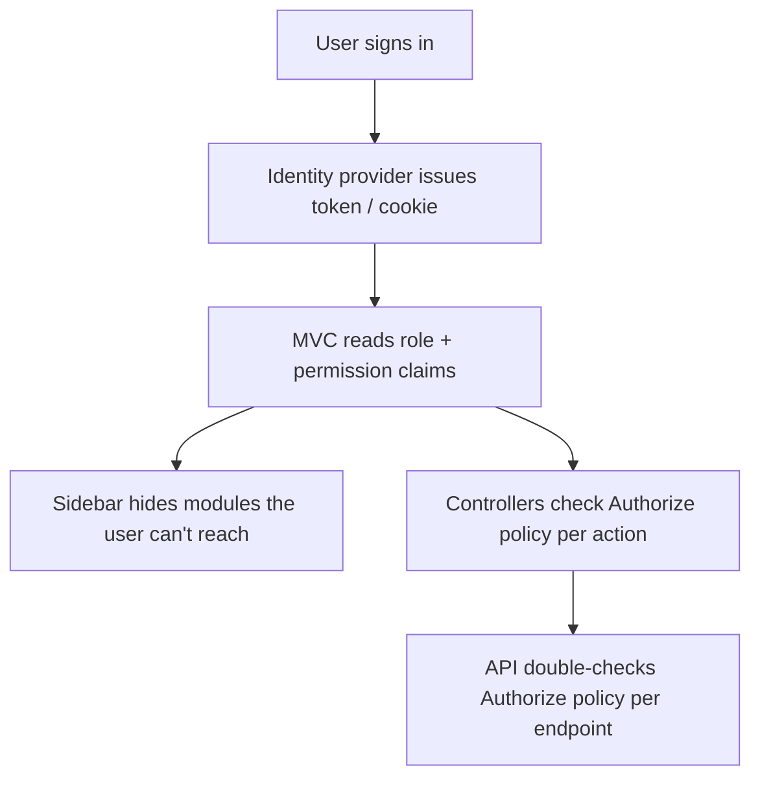
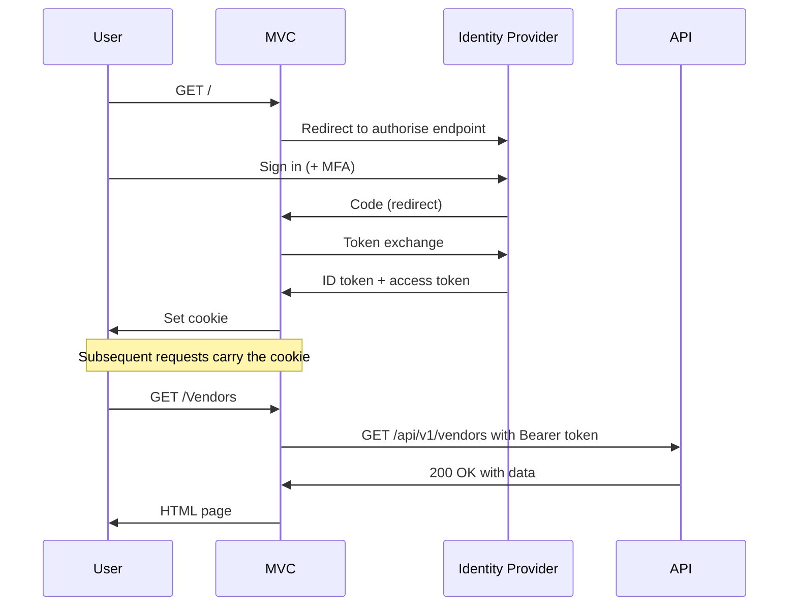

# Security & Permissions

## Table of Contents
- [Overview](#overview)
- [Roles](#roles)
- [Permission catalogue](#permission-catalogue)
- [Permission → role mapping recipes](#permission--role-mapping-recipes)
- [How permission checks work](#how-permission-checks-work)
- [Access denied behaviour](#access-denied-behaviour)
- [Authentication mechanics](#authentication-mechanics)
- [Session cookies](#session-cookies)
- [Token handling for API calls](#token-handling-for-api-calls)
- [Audit & detection](#audit--detection)
- [Security checklist for admins](#security-checklist-for-admins)

## Overview

ChuA.ERP enforces **role-based access control (RBAC)** at every layer:



Three independent enforcement points means:
- A user **cannot navigate** to a feature they lack permission for (sidebar hides it).
- If they guess the URL, the **MVC controller rejects** the request.
- If a malicious client bypasses the MVC, the **API also rejects** the request.

## Roles

| Role | Type | Scope |
|---|---|---|
| `SystemAdmin` | System | All Companies; can create new Companies and manage every user |
| `CompanyAdmin` | System | Single Company; can manage users, roles, and permissions within it |
| Custom roles | Tenant-defined | Combine permissions to match your job titles (e.g. `ApClerk`, `Buyer`, `Controller`) |

System roles are platform-shipped and cannot be deleted. Custom roles are
created by Company Admins.

> **Note** — `SystemAdmin` membership is a **break-glass** privilege.
> Restrict to one or two trusted individuals; do not use SystemAdmin for
> day-to-day work.

## Permission catalogue

The platform's 33 named permissions, grouped by area:

### Baseline
| Permission | Grants |
|---|---|
| `AuthenticatedUser` | Default; any signed-in user (used by most read pages) |
| `SystemAdmin` | The SystemAdmin role itself |
| `CompanyAdmin` | The CompanyAdmin role itself |

### Vendors (AP master)
| Permission | Grants |
|---|---|
| `VendorRead` | View vendor list and detail |
| `VendorCreate` | Add new vendors |
| `VendorUpdate` | Edit vendors / mark blocked |

### Customers (AR master)
| Permission | Grants |
|---|---|
| `CustomerRead` | View customer list and detail |
| `CustomerCreate` | Add new customers |
| `CustomerUpdate` | Edit customers / credit limits / blocked status |

### Finance
| Permission | Grants |
|---|---|
| `ChartOfAccountRead` | View COA |
| `ChartOfAccountCreate` | Add / edit / delete accounts |
| `JournalEntryRead` | View JEs (also implicitly enables Create/Edit/Delete on drafts) |
| `JournalEntryPost` | Post a draft JE to the GL |

### Accounts Payable
| Permission | Grants |
|---|---|
| `BillRead` | View bills (incl. awaiting-approval list) |
| `BillCreate` | Create / edit / delete bills |
| `BillApprove` | Approve submitted bills |
| `BillPay` | Apply payments against approved bills |

### Accounts Receivable
| Permission | Grants |
|---|---|
| `InvoiceRead` | View invoices |
| `InvoiceCreate` | Create / edit / delete invoices |
| `InvoiceApplyPayment` | Apply customer payments |

### Procurement
| Permission | Grants |
|---|---|
| `PurchaseOrderRead` | View POs |
| `PurchaseOrderCreate` | Create / edit / delete POs |
| `PurchaseOrderApprove` | Approve POs |
| `PurchaseOrderReceive` | Post goods receipts |

### Inventory
| Permission | Grants |
|---|---|
| `InventoryRead` | View items and balances |
| `InventoryCreate` | Add / edit / delete items, run imports |
| `InventoryAdjust` | Post inventory adjustments (±) |

### Sales
| Permission | Grants |
|---|---|
| `SalesOrderRead` | View SOs |
| `SalesOrderCreate` | Create / edit / delete SOs |
| `SalesOrderShip` | Post shipments |

### Workflow
| Permission | Grants |
|---|---|
| `WorkflowRead` | View workflow tasks |
| `WorkflowApprovalSubmit` | Submit approve/reject decisions |

### Reports
| Permission | Grants |
|---|---|
| `ReportRun` | Access reports and execute them |

## Permission → role mapping recipes

These are **starting templates**. Tailor to your organisation.

### `ApClerk` — junior AP staff
```
BillRead, BillCreate, VendorRead, PurchaseOrderRead,
JournalEntryRead, ReportRun, WorkflowRead
```

### `ApManager` — approves bills and oversees AP
```
ApClerk +
BillApprove, BillPay, VendorCreate, VendorUpdate,
WorkflowApprovalSubmit
```

### `ArClerk` — junior AR staff
```
InvoiceRead, InvoiceCreate, CustomerRead,
SalesOrderRead, JournalEntryRead, ReportRun, WorkflowRead
```

### `ArManager` — approves invoices and oversees AR
```
ArClerk +
InvoiceApplyPayment, CustomerCreate, CustomerUpdate,
WorkflowApprovalSubmit
```

### `Buyer` — raises POs
```
PurchaseOrderRead, PurchaseOrderCreate, VendorRead, VendorCreate,
InventoryRead, ReportRun
```

### `ProcurementManager` — approves POs
```
Buyer +
PurchaseOrderApprove, VendorUpdate, WorkflowApprovalSubmit
```

### `SalesRep` — takes orders
```
SalesOrderRead, SalesOrderCreate, CustomerRead, CustomerCreate,
InventoryRead, ReportRun
```

### `SalesManager` — approves credit changes
```
SalesRep +
CustomerUpdate, SalesOrderShip, WorkflowApprovalSubmit
```

### `WarehouseClerk` — receives and ships
```
InventoryRead, PurchaseOrderRead, PurchaseOrderReceive,
SalesOrderRead, SalesOrderShip
```

### `WarehouseSupervisor` — also adjusts
```
WarehouseClerk +
InventoryAdjust, InventoryCreate
```

### `Accountant` — drafts journal entries, runs reports
```
ChartOfAccountRead, JournalEntryRead, VendorRead, CustomerRead,
BillRead, InvoiceRead, ReportRun, WorkflowRead
```

### `SeniorAccountant` — posts journals
```
Accountant +
JournalEntryPost, ChartOfAccountCreate, WorkflowApprovalSubmit
```

### `Controller` — full finance read + posting authority
```
SeniorAccountant +
BillApprove, BillPay, InvoiceApplyPayment
```

### `Auditor` — read everything, change nothing
```
VendorRead, CustomerRead, ChartOfAccountRead, JournalEntryRead,
BillRead, InvoiceRead, PurchaseOrderRead, SalesOrderRead,
InventoryRead, WorkflowRead, ReportRun
```

## How permission checks work

When the user signs in, their identity-provider claims include:
- `role` claims (e.g. `SystemAdmin`, `ApManager`)
- `permission` claims (one per grant, e.g. `BillRead`, `BillApprove`)

The platform also calls `GET /users/me` and merges any permissions returned
by the API into the user's effective permissions.

At every protected control point:

```csharp
[Authorize(Policy = AuthorizationPolicies.BillApprove)]
public IActionResult Approve(Guid id) { ... }
```

The policy is satisfied if the user has the named permission **or** holds
the `SystemAdmin` role. (Custom roles can be excluded from SystemAdmin
fallback if your governance requires it.)

## Access denied behaviour

If a user attempts an action they lack permission for, the response is a
**friendly Access Denied page** with a request id for support:

`[SCREENSHOT: Access denied page]`

No data is leaked: the page does not reveal whether the resource exists
or what would have changed.

## Authentication mechanics

| Layer | Mechanism |
|---|---|
| Browser ↔ MVC | Cookie-based session (`ChuA.ERP.Auth` cookie) |
| MVC ↔ API | JWT bearer token attached to every outbound request |
| MVC sign-in | OIDC authorisation-code flow with PKCE |



## Session cookies

| Property | Value | Why |
|---|---|---|
| Name | `ChuA.ERP.Auth` | Tenant-distinct |
| HttpOnly | ✓ | Inaccessible to JavaScript — XSS-resistant |
| Secure | ✓ in production | HTTPS only |
| SameSite | `Lax` | Allows OIDC redirect flow while resisting CSRF |
| Expiry | 8 hours | Absolute upper bound |
| Sliding | ✓ | Resets on activity |
| Server-side store | Memory cache | Allows revocation by clearing the store |

## Token handling for API calls

The MVC fetches an access token at sign-in (OIDC `SaveTokens = true`) and
attaches it to every outbound API call as
`Authorization: Bearer <token>`. If the token expires mid-session the
service refreshes it transparently.

For dev / test environments, the platform offers an `AuthBypass` scheme
that authenticates every request as a synthetic admin — convenient for
exploration but **must be off in production**.

## Audit & detection

| Event | Logged |
|---|---|
| Sign-in success / failure | ✓ |
| Sign-out | ✓ |
| Role assignment changes | ✓ |
| Permission changes | ✓ |
| Access denied | ✓ |
| Data change | ✓ (per [Audit History](../user-guide/12-audit-history.md)) |

Suspicious-pattern detection (lots of failed sign-ins from one IP,
unusual hours for a user, bulk data access) lives in your tenant's SIEM
or your identity provider's threat detection. ChuA.ERP feeds the raw
events; correlation is upstream.

## Security checklist for admins

| Cadence | Task |
|---|---|
| Daily | Review locked accounts |
| Daily | Triage your own approval queue (don't let it stale) |
| Weekly | Review new-user requests and confirm role appropriateness |
| Monthly | Reconcile your tenant's user list against HR's active-employee roster |
| Quarterly | Run a permission audit — does every role grant only what it should? |
| Quarterly | Test access-denied paths (sign in as a low-privilege user; try to access admin pages) |
| Annually | Rotate any local-account passwords and OIDC client secrets |
| Annually | Review the `SystemAdmin` list — should still be only 1-2 people |
| Annually | Walk-through the security checklist with your auditor |

> **Tip** — Treat permissions as a **business control**, not an IT
> concern. The right person should be approving permission changes —
> typically the user's manager plus finance / compliance for any role
> that touches money.
