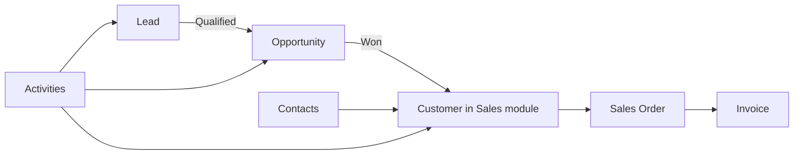

# CRM Module

> **Availability** — **Planned**. The CRM (Customer Relationship Management)
> module is on the ChuA.ERP roadmap. This guide describes the **intended
> functionality** so business teams can plan adoption and integration. In
> the current release, you can still maintain customer records (in the
> Sales module) and document interactions externally; the CRM module will
> bring those into the platform.

## Table of Contents
- [Purpose](#purpose)
- [Relationship to the Sales module](#relationship-to-the-sales-module)
- [Roadmap features](#roadmap-features)
- [Leads](#leads)
- [Opportunities](#opportunities)
- [Contacts](#contacts)
- [Activities](#activities)
- [Notes](#notes)
- [Tasks](#tasks)
- [Customer interactions timeline](#customer-interactions-timeline)
- [Migration from external CRMs](#migration-from-external-crms)
- [Interim workarounds](#interim-workarounds)

## Purpose

Whereas the **Sales** module records the **financial** customer
relationship (orders, invoices, payments, credit limit), CRM records the
**pre-sales and ongoing relationship**:

- Leads — interest expressed by a prospect not yet a customer
- Opportunities — qualified leads with revenue probability
- Contacts — people inside customer / prospect organisations
- Activities — calls, meetings, emails
- Tasks — what needs to be done next
- Notes — context that doesn't fit into any structured field

When CRM ships, *Sales › Customers* will gain a **CRM tab** showing the
contact roster, opportunity history, and recent activity for that
customer.

## Relationship to the Sales module

A Lead converts to an Opportunity. An Opportunity that **closes Won**
converts to a Customer. Customers continue to accumulate Contacts,
Activities, and Notes throughout their life cycle.

## Roadmap features

| Feature | Detail |
|---|---|
| Lead capture | Manual entry + web-to-lead form ingestion |
| Lead qualification | Score and convert flow |
| Opportunity tracking | Pipeline stages (Qualification → Proposal → Negotiation → Closed Won/Lost) with weighted forecasting |
| Contacts | Person-level records linked to customers / leads |
| Activities | Timestamped log of calls, meetings, emails |
| Tasks | Assigned to-dos with due dates |
| Notes | Free-form notes attached to any CRM object |
| Email integration | Optional Outlook / Gmail sidebar to log emails as activities |
| Phone integration | Optional CTI integration |
| Customer 360 timeline | Combined activity + sales + AR view per customer |
| Forecast reports | Pipeline weighted by stage probability |

## Leads

A **Lead** is a person or organisation that has expressed interest but
hasn't yet been validated as a real sales opportunity.

| Field | Notes |
|---|---|
| Lead source | Web form · Trade show · Referral · Cold outreach · Partner |
| Status | New · Working · Qualified · Disqualified |
| Owner | Sales rep assigned |
| Company name | Prospect's company |
| Primary contact | Name, title, email, phone |

When a lead is qualified, an authorised user **converts** it. The
conversion wizard:
1. Promotes the lead's company to a customer in the Sales module
2. Promotes the primary contact to a Contact
3. Creates an Opportunity in the chosen stage
4. Copies the activity history forward

## Opportunities

| Field | Notes |
|---|---|
| Customer / lead | What organisation it is for |
| Owner | Sales rep |
| Stage | Qualification · Proposal · Negotiation · Closed Won · Closed Lost |
| Estimated value | Money — for forecasting |
| Probability | % — typically derived from stage |
| Close date | Expected close |
| Source | Lead source if converted from a lead |

The **pipeline view** groups opportunities by stage. Drag-and-drop moves
opportunities between stages (planned UX).

## Contacts

A Contact is a person inside a customer or lead organisation. Multiple
contacts can be attached to one customer (e.g. AP clerk, decision maker,
end user). Each contact carries:
- Name, title
- Email, phone
- Reporting relationship (optional)
- Role tags (Decision Maker, Champion, Influencer, AP, IT, Procurement, …)

## Activities

Activities are the **time-stamped record** of every interaction:

| Activity type | Examples |
|---|---|
| Call | Inbound / outbound; duration; outcome |
| Meeting | Date, attendees, location, agenda, outcome |
| Email | Subject, recipients, body excerpt |
| Demo | Product demo with attendees |
| Quote sent | Reference to a Quote / SO |

Activities can be **logged in real time** (e.g. "I'm in this meeting now")
or **back-logged** (e.g. "Logged a call from yesterday's voicemail").

## Notes

Notes are free-form text attached to a lead, opportunity, customer, or
contact. Unlike Activities, they have no fixed schema — perfect for "the
champion told me their CFO is leaving" intel.

> **Tip** — Notes are visible to everyone with access to the parent
> object. Don't use them for confidential or HR-sensitive content.

## Tasks

Tasks are **to-dos with a due date and owner**. Tasks integrate with the
[Workflow & Approvals](../user-guide/08-workflow-approvals.md) module —
overdue tasks surface in the assignee's queue.

| Field | Notes |
|---|---|
| Title | Short description |
| Owner | Assignee |
| Due date | When it should be done |
| Linked to | A lead / opportunity / customer / contact |
| Priority | Low · Normal · High · Critical |
| Status | Open · In progress · Done · Cancelled |

## Customer interactions timeline

The Customer 360 timeline (planned) interleaves:
- CRM activities (calls, meetings, emails)
- Sales documents (SOs, invoices)
- Finance events (payments, credit changes)
- Support events (if a help-desk integration exists)

This gives any user opening a customer record a complete chronological
picture — invaluable for handover, account reviews, and dispute
investigation.

## Migration from external CRMs

When CRM ships, an **import wizard** will accept exports from common
external CRMs:
- Salesforce
- HubSpot
- Zoho CRM
- Pipedrive
- Microsoft Dynamics 365

Plan migration with your account team. Map your existing pipeline stages,
custom fields, and user accounts before import.

## Interim workarounds

Until CRM ships, run the customer relationship workflow externally:

| Workflow | Workaround |
|---|---|
| Lead tracking | Spreadsheet or external CRM (Salesforce, HubSpot, etc.) |
| Opportunity pipeline | External CRM or a shared sheet by sales manager |
| Activity logging | Email + calendar; share notes in shared drive |
| Contacts roster | Stored in your email contacts or a spreadsheet |
| Customer 360 view | Combine the ChuA *Customer details* page + your CRM tab |

When you create a customer in *Sales › Customers*, include the CRM
external id (if any) in the customer's metadata so a future migration
can reconcile records.

> **Note** — If your business is highly CRM-driven and cannot wait for
> the planned module, the platform provides an API your existing CRM
> can sync against. Talk to IT and your account team about an
> integration shim.
