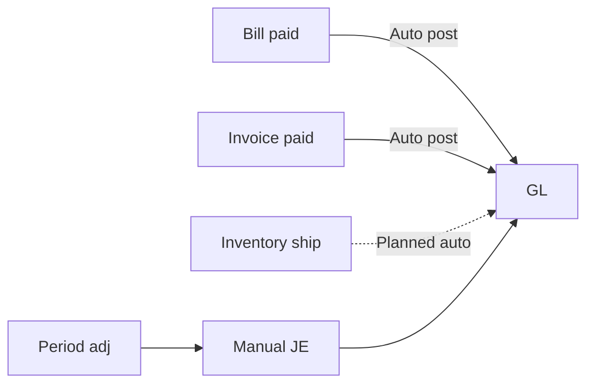
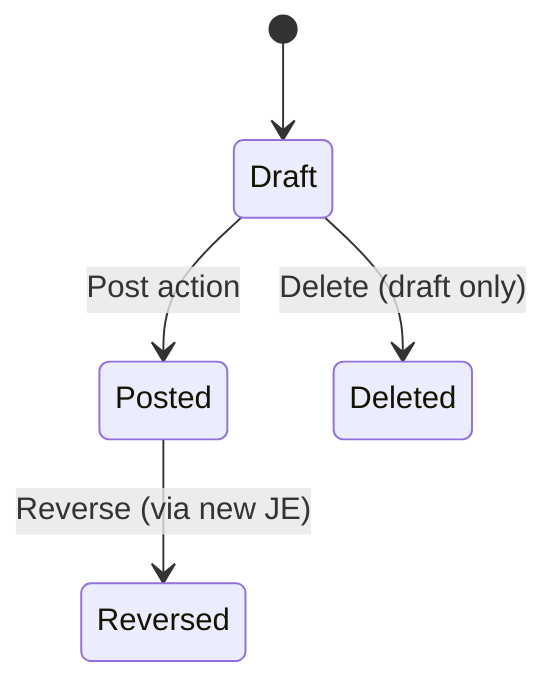

# Finance Module

> **Availability** — Available (Chart of Accounts, Journal Entries with
> Draft/Post lifecycle, basic period filtering). General Ledger query
> screens, Trial Balance built-in report, Financial Statements wizard,
> and Bank Reconciliation are **Planned**.

## Table of Contents
- [Overview](#overview)
- [Who uses it](#who-uses-it)
- [Permissions](#permissions)
- [Chart of Accounts](#chart-of-accounts)
- [Journal Entries](#journal-entries)
- [Posting journal entries](#posting-journal-entries)
- [Reversing entries](#reversing-entries)
- [Accounts Payable](#accounts-payable)
- [Accounts Receivable](#accounts-receivable)
- [General Ledger](#general-ledger)
- [Fiscal periods](#fiscal-periods)
- [Trial Balance](#trial-balance)
- [Financial Statements](#financial-statements)
- [Bank Reconciliation](#bank-reconciliation)
- [Worked scenarios](#worked-scenarios)
- [Best practices](#best-practices)
- [FAQ](#faq)

## Overview

The Finance module is the **central nervous system** of ChuA.ERP. Every
business transaction — bills, invoices, payments, inventory movements —
ultimately reduces to entries in the General Ledger via journal entries.
Some of these are posted automatically by other modules; others are
keyed directly in *Finance › Journal Entries*.

## Who uses it

| Role | Activities |
|---|---|
| **Accountant** | Post manual journals, period adjustments |
| **Senior Accountant / Reviewer** | Approve journal entries (two-eyes) |
| **Controller** | Period close, financial statement prep, sign-off |
| **CFO** | Read-only review, dashboards |
| **Auditor** | Audit trail review |

## Permissions

| Permission | Grants |
|---|---|
| `ChartOfAccountRead` | View the chart |
| `ChartOfAccountCreate` | Add / edit / delete accounts |
| `JournalEntryRead` | View JEs |
| `JournalEntryPost` | Post draft JEs to the GL |

JE Create, Update, and Delete inherit `JournalEntryRead` in the current
release; posting is the gated action.

## Chart of Accounts

### Account record fields

| Field | Required | Notes |
|---|---|---|
| Account code | ✓ | 1-40 chars; unique within company; immutable |
| Name | ✓ | 1-200 chars |
| Account type | ✓ | Asset · Liability · Equity · Revenue · Expense |
| Normal balance | ✓ | Debit · Credit (must match type — assets debit, liabilities credit, etc.) |
| Postable | ✓ | Untick for category headers; postable accounts accept GL postings |
| Parent account | | Optional — builds a hierarchy |
| Currency | ✓ | Account's reporting currency |

### Creating an account

1. *Finance › Chart of Accounts › New* — requires `ChartOfAccountCreate`.
2. Enter the code, name, type, normal balance, postable flag, currency.
3. If this account rolls up into a parent, choose the parent.
4. Click **Create**.

`[SCREENSHOT: Create account form]`

> **Tip** — Plan your COA before creating accounts. A consistent 4 or 5
> digit code with type bands (1xxx Assets, 2xxx Liabilities, 3xxx Equity,
> 4xxx Revenue, 5xxx Expenses) makes reports legible. Once an account
> has postings you cannot rename its code.

### Account types & normal balance

| Type | Normal balance | Examples |
|---|---|---|
| Asset | Debit | Cash, AR, Inventory, Fixed Assets |
| Liability | Credit | AP, Loans, Accrued Liabilities |
| Equity | Credit | Owner's Equity, Retained Earnings |
| Revenue | Credit | Sales Revenue, Service Revenue |
| Expense | Debit | COGS, Salaries, Rent, Utilities |

The system enforces sign conventions: a debit to a revenue account is
allowed (it's a contra-revenue) but appears with appropriate visual
warnings in reports.

### Postable vs non-postable

Non-postable accounts are **header / category** accounts used only for
grouping in reports. The system refuses to post journal entries directly
to a non-postable account; you must post to its postable children.

### Filtering the chart

The *Chart of Accounts* list supports an **Account type** dropdown filter
plus a Search box.

## Journal Entries

A Journal Entry (JE) records one or more **debits and credits** that must
sum to zero. JEs originate from:
- Manual postings by accountants
- (Future) Auto-postings from other modules

### JE record fields

| Field | Required | Notes |
|---|---|---|
| Entry number | ✓ | Free format; unique within company |
| Entry date | ✓ | Determines fiscal period |
| Fiscal period | ✓ | Pre-existing open period |
| Currency | ✓ | The JE's transaction currency |
| Exchange rate | ✓ | Defaults 1.0; needed if currency ≠ company base |
| Memo | | Free text — your "why" |
| Reference | | External reference id (audit, source doc) |
| Lines | ✓ | At least two; each line has account, debit, credit, description |

### Balanced entry rule

The JE form **forces** ∑ debit = ∑ credit before allowing save and post. The
system displays running totals and flags out-of-balance state.

### JE lifecycle

> **Warning** — **Posted JEs cannot be edited or deleted.** This is by
> design — the GL is the immutable record. To correct a posted JE, post a
> **reversing entry**.

### Creating a draft JE

1. *Finance › Journal Entries › New* — requires `JournalEntryRead`.
2. Enter Entry number, Entry date, Fiscal period, Currency, Memo, Reference.
3. Two empty lines are pre-filled. For each line:
   - Choose the account
   - Enter the debit OR the credit (not both)
   - Add a line description
4. Add more lines with **+ Add line**.
5. Watch the totals at the bottom — debit must equal credit.
6. Click **Save as draft** OR **Save and post**.

`[SCREENSHOT: Create JE form with debit/credit totals]`

> **Tip** — Save as draft when you want a reviewer to look it over;
> Save and post is the same as "I'm both preparer and reviewer" — only
> appropriate where two-eyes is not required by policy.

## Posting journal entries

Posting is **irreversible** (only correctable by a reversing entry).

1. Open a draft JE.
2. Click **Post**.
3. The confirmation page (covered by a section overlay during processing)
   shows the entry summary.
4. Click **Confirm post**.

`[SCREENSHOT: Post JE confirmation with section overlay]`

### Effects

- JE status → **Posted**
- The corresponding debit/credit move into the GL
- The Trial Balance and any account balance derived from postings updates
- The audit trail captures who posted, when, and the correlation id

> **Permission required** — `JournalEntryPost`.

> **Note** — Two-eyes / preparer ≠ poster controls are recommended for
> any sensitive period or account. Configure via the
> [Workflow Engine](workflow-engine.md).

## Reversing entries

To correct a posted JE:

1. Open the posted JE.
2. Click **Reverse** (planned in the UI; today create a new JE manually).
3. The system pre-fills a new draft JE with the same lines, debits and
   credits **swapped**, dated the reversal date.
4. Add a Memo explaining why (`Reversal of JE-2026-0142 — wrong period`).
5. Post the reversing entry.

The original JE remains Posted; the reversal posts a counter-balancing
entry. Together they net to zero.

## Accounts Payable

AP is the **sub-ledger** that tracks what you owe vendors. It is fed by:

- Bill postings (Purchasing module) — AP credit increases
- Bill payments — AP debit reduces

Reconciliation: at any moment, `Sum(AP control account in GL)` should
equal `Sum(outstanding bills)`. Run the *Vendor Aging* report periodically
to verify.

## Accounts Receivable

AR mirrors AP for customers:

- Invoice posting — AR debit increases (asset)
- Customer payment application — AR credit reduces

Reconcile via the *Customer Aging* report against the AR control
account balance.

## General Ledger

The **General Ledger (GL)** is the record of every debit and credit
across every account. It is fed exclusively by posted journal entries
(direct, or auto-generated from other modules).

> **Availability** — A **GL query screen** with account drill-down,
> running balance, and date-range filtering is **Planned**. Today, query
> the GL via the *GL Detail* report.

## Fiscal periods

> **Availability** — A fiscal-periods admin screen is **Planned**.
> Periods exist today (referenced on JEs by id) and are managed via the
> platform's setup procedure.

A fiscal period is a span of time (typically a calendar month or
4-week period) during which transactions can be posted. Period statuses:

| Status | Meaning |
|---|---|
| Open | Accepting postings |
| Closed | No new postings |
| Final | Locked permanently (after audit) |

Period close (planned in-UI) walks you through:
1. Final adjustments
2. Reconciliations
3. Marking the period Closed
4. Generating end-of-period financial statements

## Trial Balance

> **Availability** — Built-in TB screen is **Planned**. Today, run the
> *Trial Balance* report from *Reports*.

A Trial Balance lists every account with its debit and credit balances at
a point in time. Total debits must equal total credits — if not, there is
a posting integrity issue (vanishingly rare with our balanced-entry
enforcement, but worth checking after major events).

## Financial Statements

> **Availability** — A guided **Financial Statements wizard** producing
> Balance Sheet, Income Statement, and Cash Flow PDFs is **Planned**.

Today, generate via the *Trial Balance* + *GL Detail* reports exported to
Excel, then build statements from the COA hierarchy.

## Bank Reconciliation

> **Availability** — **Planned**.

A bank reconciliation matches the GL cash account balance to the bank
statement, identifying:
- Items in the GL but not on the statement (in-transit cheques, etc.)
- Items on the statement but not in the GL (bank fees, interest)
- Timing differences

Until this ships, perform reconciliations in Excel using the *GL Detail*
export for the cash account.

## Worked scenarios

### Scenario 1 — Monthly accrual

> Marketing incurred services in May but the bill arrives in June. Accrue
> May expense via a JE.

1. *Finance › Journal Entries › New*.
2. Entry number `ACC-2026-05-001`, Entry date 2026-05-31, Period May 2026.
3. Lines:
   | Account | Debit | Credit | Description |
   |---|---|---|---|
   | 5310 Marketing Expense | 4,500.00 | | Accrual — Promomerch services |
   | 2150 Accrued Liabilities | | 4,500.00 | Accrual — Promomerch services |
4. Memo: "Accrue May marketing services per Promomerch SOW dated 2026-04-15. Reverses 2026-06-01."
5. Save and post.
6. On 2026-06-01, post the reversal entry (debit 2150, credit 5310).
7. When the actual bill arrives, post normally; the net P&L impact is in
   May where the services were rendered.

### Scenario 2 — Period close

> Close May 2026 after final adjustments.

1. Confirm all bills, invoices, and shipments dated May are posted.
2. Run Trial Balance → review imbalances or unusual values.
3. Run Vendor Aging + Customer Aging → reconcile to AP / AR control
   accounts.
4. Post any final adjustments (depreciation, accruals, FX revaluation).
5. Run Trial Balance again to confirm.
6. Mark period Closed (planned in-UI; admin action today).
7. Generate statements.

### Scenario 3 — Correcting a wrongly-posted JE

> Yesterday Bob posted a JE with $1,000 to the wrong expense account.

1. *Finance › Journal Entries* — find Bob's JE.
2. Do **not** delete or edit — it's posted.
3. Create reversing JE:
   - Same date as original (or today, per policy)
   - Lines swap debit and credit
   - Memo: "Reversal of JE-... — posted to wrong account. See JE-... for correction."
4. Post the reversal.
5. Post a new correct JE.
6. Net effect on the GL: original + reversal + correct = correct.

## Best practices

- **Always include a Memo and Reference.** "Why" and "what supports this"
  are what audit asks.
- **Two-eyes posting for material entries.** Have a reviewer who is not
  the preparer approve via workflow.
- **Reconcile monthly, close monthly.** Don't let the unposted /
  unreconciled backlog grow.
- **Never override the balanced-entry rule.** The system won't let you,
  but be wary of tools that bypass it.
- **Use posting-date discipline.** Date JEs in the period the activity
  belongs to, not the date you happen to be entering them.
- **Limit `JournalEntryPost` permission.** Posters touch the GL —
  restrict to qualified accountants.
- **Run trial balance before every period close.** Catches issues early.

## FAQ

**Q: Can I bulk-import journal entries?**
A: Bulk import is **Planned**. Today, enter via the UI or via the API
   (admin / power user).

**Q: How do I see all postings to a specific account?**
A: Run the *GL Detail* report filtering by the account and a date range.
   Once the GL query screen ships, you'll get an interactive drill-down.

**Q: Can I post to a closed period?**
A: No. Reopen the period (planned admin action) only after careful
   consideration — period closes are typically aligned with regulatory
   filings.

**Q: A JE posted with the wrong exchange rate. How do I fix?**
A: Reverse and re-post with the correct rate. Do not attempt to edit
   the posted JE.

**Q: How do I post depreciation?**
A: Manually each period until depreciation automation ships (planned).
   Maintain a schedule spreadsheet; create a JE per period: Debit
   Depreciation Expense, Credit Accumulated Depreciation.

**Q: Year-end retained earnings rollover?**
A: Manual closing entry posted on the last day of the fiscal year: zero
   out revenue and expense accounts to Retained Earnings. Automation is
   planned.
