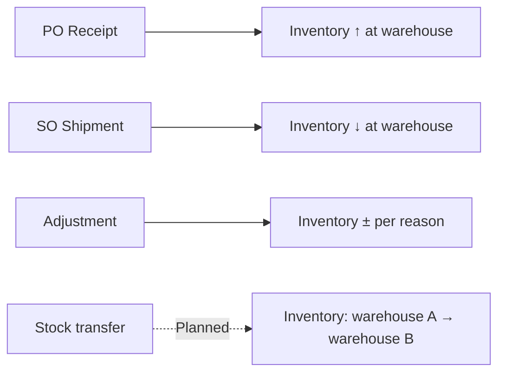

# Inventory Module

> **Availability** — Available (Items, warehouse balances, adjustments,
> import demo). Cycle counts, lot tracking, serial tracking, multi-warehouse
> transfers, and automatic reorder triggers are **Planned**.

## Table of Contents
- [Overview](#overview)
- [Who uses it](#who-uses-it)
- [Permissions](#permissions)
- [Items](#items)
- [Warehouses](#warehouses)
- [Stock balances](#stock-balances)
- [Stock transfers](#stock-transfers)
- [Inventory adjustments](#inventory-adjustments)
- [Cycle counts](#cycle-counts)
- [Lot tracking](#lot-tracking)
- [Serial tracking](#serial-tracking)
- [Reorder levels](#reorder-levels)
- [Importing items](#importing-items)
- [Inventory valuation](#inventory-valuation)
- [Worked scenarios](#worked-scenarios)
- [Best practices](#best-practices)
- [FAQ](#faq)

## Overview

The Inventory module is the **system of record for what you have, where**.
Every physical movement — vendor receipt, customer shipment, inter-warehouse
transfer, damage write-off — is reflected as an inventory record. Other
modules (Purchasing, Sales) call into Inventory whenever movement happens.

## Who uses it

| Role | Activities |
|---|---|
| **Warehouse Clerk** | Receive, ship, adjust |
| **Warehouse Supervisor** | Authorise adjustments, run cycle counts |
| **Buyer** | Maintain item master, set reorder levels |
| **Accountant** | Reconcile inventory valuation with GL |
| **Auditor** | Review adjustment reasons and counts |

## Permissions

| Permission | Grants |
|---|---|
| `InventoryRead` | View item master, balances |
| `InventoryCreate` | Create / edit / delete items, run imports |
| `InventoryAdjust` | Post stock adjustments (±) at a warehouse |

## Items

The **item master** stores each SKU you stock or sell.

### Item record fields

| Field | Required | Notes |
|---|---|---|
| SKU | ✓ | 1-60 chars; unique within company; immutable |
| Name | ✓ | 1-200 chars; the display name |
| Default unit of measure | ✓ | EA, KG, L, BOX, … |
| Stocked | | Tick for physical goods; untick for services |
| Reorder point | | Threshold below which a replenishment alert (planned) fires |

### Creating an item

1. *Inventory › Items › New* — requires `InventoryCreate`.
2. Enter SKU, Name, UoM, tick Stocked, optionally set Reorder point.
3. Click **Create item**.

`[SCREENSHOT: Create item form]`

> **Tip** — Maintain a consistent SKU scheme (`AAA-NNNNN`, or category prefix).
> Once an item has movement, the SKU cannot change.

### Editing / deactivating items

Open the item → **Edit**. Name, UoM, Stocked, and Reorder point are editable.
SKU is locked. To retire an obsolete item, untick **Stocked** and stop using
it in new POs / SOs.

## Warehouses

> **Availability** — A *Warehouses* master-data page is **Planned**. Today
> warehouses are referenced by Guid on movements; your tenant's warehouses
> are defined at setup time and exposed to the UI by id.

Common configurations:

| Setup | Use case |
|---|---|
| Single warehouse | Small operations |
| Main + Returns | Mid-size; separate returned-goods stock |
| Multi-site | Retail with several stores; distribution centres |
| 3PL / consignment | Stock held by a third-party logistics provider |

## Stock balances

You can query the on-hand and available quantity for any item at any
warehouse:

1. *Inventory › Items › [item] › Details*.
2. Use the **Check warehouse balance** mini-form: type the warehouse id,
   click **Check**.
3. The balance page shows:
   - **On hand** — what is physically there
   - **Available** — on hand minus what is committed to outstanding SOs

`[SCREENSHOT: Warehouse balance page]`

> **Availability** — A **multi-warehouse balance table** showing on-hand
> across every warehouse on one page is **Planned**.

## Stock transfers

> **Availability** — **Planned**.

Once available, stock transfers will move quantity between warehouses with
no GL impact and full audit trail. Today, transfers are recorded as two
adjustments (one negative at source, one positive at destination) with a
shared reason code.

## Inventory adjustments

Adjustments are the **manual override** to bring system on-hand in line
with physical reality.

### When to adjust

- Damaged goods discovered during cycle count
- Theft / shrinkage write-off
- Found items missing from system
- Counting errors

### Posting an adjustment

1. *Inventory › Items › [item]*.
2. Click **Adjust** (requires `InventoryAdjust`).
3. Fill:
   - Warehouse
   - Delta — positive to add, negative to remove (in the item's UoM)
   - Reason — required text describing why
4. Click **Confirm**.

`[SCREENSHOT: Adjust inventory form]`

> **Warning** — Adjustments are **fully audited**. The actor, timestamp,
> warehouse, delta, and reason are recorded permanently. Use clear reason
> codes (e.g. `cycle-count-may-2026`, `damage-incident-12`, `theft-loss-23`)
> so reports can group adjustments by cause.

### Adjustment audit

The audit log shows every adjustment with the actor and reason. Use the
**Inventory Adjustment Audit** report (planned) for periodic review.

## Cycle counts

> **Availability** — **Planned**.

A guided cycle-count workflow will:
1. Generate a count sheet for a warehouse and a sample of items
2. Allow warehouse staff to enter physical counts
3. Auto-compute variances
4. Require a supervisor to authorise the adjustment posting
5. Record everything against the count number

Until shipped, run cycle counts manually:
1. Print the system on-hand for the items / location.
2. Physical count.
3. For each variance, post an `Adjust` with reason `cycle-count-YYYY-MM-NNN`.
4. Have a supervisor review the adjustments report monthly.

## Lot tracking

> **Availability** — **Planned**.

Lot tracking will let you receive and ship by lot number (batch). Critical
for:
- Food / pharma (FIFO by lot, expiry)
- Cosmetics, chemicals
- Any item with batch-level recall requirements

## Serial tracking

> **Availability** — **Planned**.

Serial tracking will store the serial number of each unit through its
life — receipt, shipment, and back (returns / warranty). Common in
electronics, medical devices, vehicles.

## Reorder levels

The `Reorder point` field on an item is informational today. Once **reorder
alerts** ship (planned), the system will:
- Flag items where available ≤ reorder point
- Surface them on the buyer's dashboard
- Optionally raise a suggested PO with the default vendor

For now, run the *Items below reorder point* report (planned) periodically
to identify replenishment needs.

## Importing items

> **Availability** — UI **demo** of the import flow ships in the current
> release; the backing chunked-import API is **Planned**.

The Import demo page shows the full-page progress experience for large
imports — useful for buyer training even before live import is wired:

1. *Inventory › Import items*.
2. Choose a CSV file from your workstation.
3. Click **Start import**.
4. The full-page overlay shows progress percentage, row count, and a
   **Cancel** button.
5. On completion, a summary banner shows rows processed and any errors.

`[SCREENSHOT: Import progress overlay at 60%]`

When the production import endpoint ships, the same UI will report real
server-side progress over SSE / WebSocket.

> **Note** — Until the production endpoint is available, the import does
> not actually create items. It is provided to demonstrate the UX so
> users can pre-train.

## Inventory valuation

> **Availability** — **Planned**.

Coming features:
- Multiple costing methods: FIFO, weighted average, standard cost
- Cost layers per receipt
- Period-end inventory valuation report
- COGS auto-post on shipment

Today, valuation lives in your accountant's spreadsheet; manual journal
entries reconcile it back to the GL.

## Worked scenarios

### Scenario 1 — Discovered damage during cycle count

1. Cycle count finds 5 fewer WidgetSKU units than the system shows in
   warehouse Main.
2. *Items › WidgetSKU › Adjust*.
3. Warehouse Main, Delta `-5 EA`, Reason `cycle-count-2026-05 damage; broken pallet, photos with supervisor`.
4. Confirm. Inventory drops by 5.
5. A subsequent journal entry writes off the inventory loss to the
   appropriate expense account.

### Scenario 2 — Customer returned stock to a different warehouse

1. SO shipped from warehouse Main; customer returned to warehouse
   Returns.
2. *Items › WidgetSKU › Adjust* in Returns, Delta `+1 EA`,
   Reason `cust-return-SO-2026-0317`.
3. After inspection, transfer the unit from Returns back to Main
   (today: two adjustments; once stock transfers ship, a single
   transfer document).

### Scenario 3 — Imported a new product catalogue

1. Procurement sends a CSV of 1,200 SKUs from the new supplier.
2. *Items › Import items*.
3. Upload the CSV, watch the progress bar.
4. Review the summary — any rows that failed are listed with the row
   number and reason.
5. Fix the failed rows in the CSV; re-import only those rows.

## Best practices

- **Use clear adjustment reasons.** They are the only narrative auditors
  see for any inventory imbalance.
- **Reconcile monthly.** Match inventory valuation to GL inventory
  accounts at period end.
- **Limit `InventoryAdjust` permission.** Adjustments are powerful;
  restrict to warehouse supervisors. Anyone with `InventoryAdjust` can
  effectively write off stock.
- **Cycle count regularly.** Even with planned automation, physical
  counts are the ground truth.
- **Maintain item names consistently.** Sales reps will rely on Name
  for picking lists once printable picks ship.

## FAQ

**Q: Available is less than On hand. Why?**
A: Available subtracts quantity committed to open Sales Orders. If your SO
   reserves but ships later, Available reflects the soft reservation.

**Q: I adjusted to the wrong warehouse. Can I undo?**
A: No — adjustments are immutable. Post a counter-adjustment (same item,
   opposite sign) with a reason like "correction for adj-2026-0517-abc".

**Q: Why does an item show 0 on hand even though I just received it?**
A: Confirm the receipt was posted to the same warehouse you are checking.
   Receipts go to the warehouse selected on the receipt form.

**Q: Can I have negative inventory?**
A: System policy defaults to allowing negative — useful for backorder
   workflows. Your Company Admin can disable negative inventory at the
   tenant level if your operation requires strict positivity.

**Q: When does the GL move when I ship goods?**
A: Today, manually via a journal entry. Once auto-COGS-posting ships,
   shipment will debit COGS and credit Inventory in the GL automatically.

**Q: Lot tracking is critical for our regulated industry. When is it
coming?**
A: Talk to your account team; lot tracking is on the roadmap. In the
   interim, store lot numbers in the line description and run lot-recall
   queries via the Reports module (planned helper) or directly against
   the audit log.
