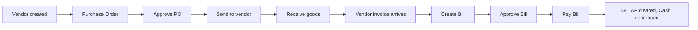
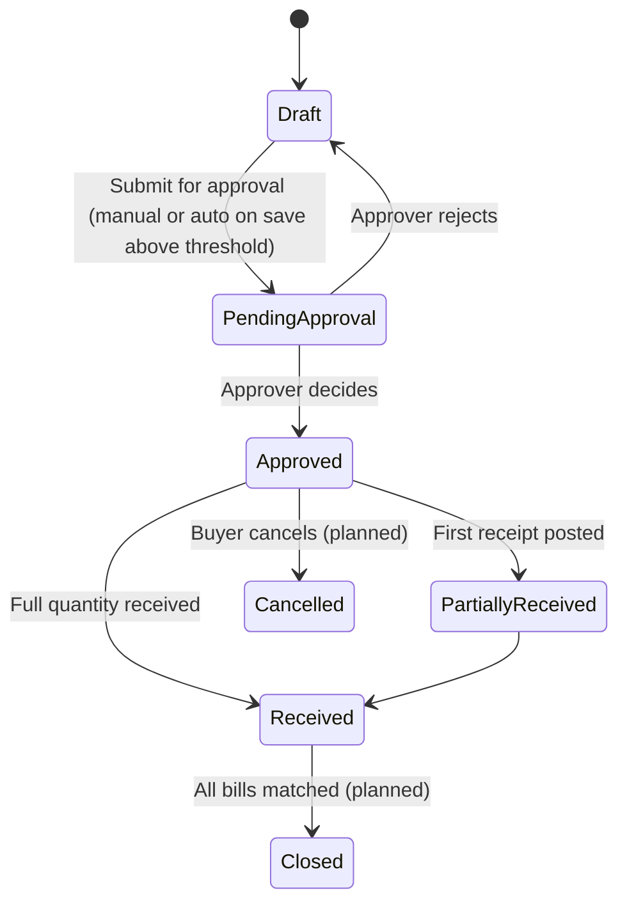
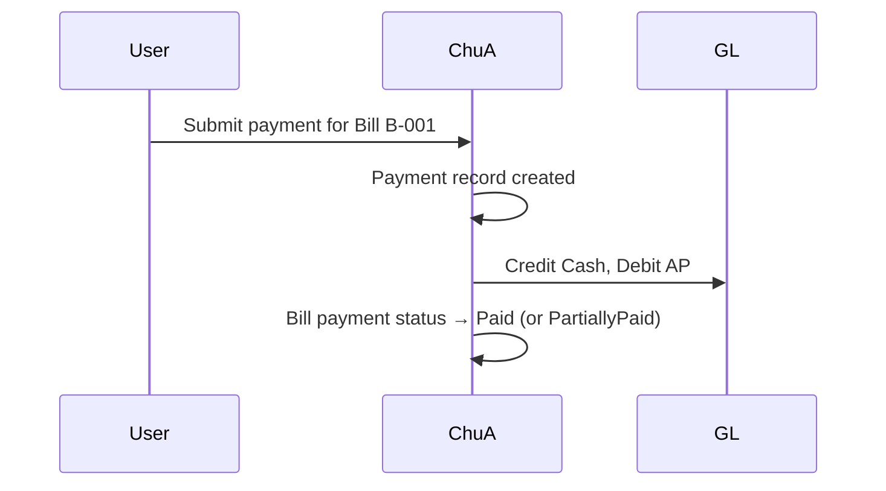

# Purchasing Module

> **Availability** — Available (Vendors, Purchase Orders, Bills). Purchase
> Requisitions and Returns are **Planned**.

## Table of Contents
- [Overview](#overview)
- [Who uses it](#who-uses-it)
- [Permissions](#permissions)
- [Vendors](#vendors)
- [Purchase Requisitions](#purchase-requisitions)
- [Purchase Orders](#purchase-orders)
- [Receiving goods](#receiving-goods)
- [Bills (Vendor invoices)](#bills-vendor-invoices)
- [Paying bills](#paying-bills)
- [Returns](#returns)
- [Approval workflows](#approval-workflows)
- [Reports](#reports)
- [Worked scenarios](#worked-scenarios)
- [Common mistakes & validation rules](#common-mistakes--validation-rules)
- [FAQ](#faq)

## Overview

The Purchasing module manages everything from registering a new supplier
through to paying their invoice. The flow:

Each step has a corresponding screen in *Purchasing* in the sidebar.

## Who uses it

| Role | Typical activities |
|---|---|
| **Buyer / Purchaser** | Create vendors, raise POs, send POs to suppliers |
| **AP Clerk** | Enter bills, match to POs, submit for approval |
| **Receiver / Warehouse** | Record goods receipts against POs |
| **AP Manager** | Approve bills, oversee aging |
| **Procurement Manager** | Approve POs above threshold |
| **Controller** | Oversee AP, sign off on critical decisions |

## Permissions

| Permission | Grants |
|---|---|
| `VendorRead` | View vendor list and details |
| `VendorCreate` | Create vendors |
| `VendorUpdate` | Edit / deactivate vendors |
| `PurchaseOrderRead` | View POs |
| `PurchaseOrderCreate` | Create / edit / delete POs |
| `PurchaseOrderApprove` | Submit Approve decisions on POs |
| `PurchaseOrderReceive` | Post goods receipts against POs |
| `BillRead` | View bills |
| `BillCreate` | Create / edit / delete bills |
| `BillApprove` | Approve bills |
| `BillPay` | Apply payments against bills |

See [Security & Permissions](../admin/security-permissions.md) for role
combinations.

## Vendors

Vendors are the master data records for your suppliers.

### Vendor record fields

| Field | Required | Notes |
|---|---|---|
| Vendor code | ✓ | 1-40 chars; unique within the company; *cannot* be changed once set |
| Legal name | ✓ | 1-200 chars; the legal entity name on contracts |
| Default currency | ✓ | 3-letter ISO code (USD, EUR, GBP, …) |
| Payment terms (days) | ✓ | 0-365 days; the default Net term |
| Blocked from new transactions | | Tick to prevent new POs / bills against this vendor |

### Creating a vendor

1. *Purchasing › Vendors*
2. Click **New vendor** (top-right) — requires `VendorCreate`.
3. Fill in the form. **Vendor code** must be unique; **legal name** should
   match the vendor's contract / W-9 / equivalent identity document.
4. Click **Create vendor**.
5. You land on the vendor's detail page.

`[SCREENSHOT: New vendor form]`

> **Tip** — Adopt a consistent vendor code scheme (`V-NNNNN`, or 4-letter
> mnemonic + sequence) and document it in your AP procedures.

### Editing a vendor

Open the vendor detail page → **Edit** (requires `VendorUpdate`).

The **vendor code is locked once created** to preserve referential
integrity with historical bills / POs. Legal name, currency, payment terms,
and blocked status are editable. Changes are audited.

### Blocking a vendor

Use **Blocked** when:
- The vendor is in dispute
- Compliance has flagged them (sanctions, audit findings)
- The vendor was set up in error
- The vendor has been replaced by a merged entity

Blocked vendors disappear from PO and Bill *create* dropdowns; existing
documents are not affected.

### Deleting a vendor

> **Warning** — Deletion is reserved for vendors that have **never** been
> used. The system rejects delete if any PO or bill references the vendor.
> Block instead.

## Purchase Requisitions

> **Availability** — **Planned**.

Coming feature for environments that need a pre-PO request stage. Today,
authorised buyers raise POs directly. Talk to your Company Admin if your
procurement policy requires requisitions before POs can be created.

## Purchase Orders

A Purchase Order (PO) is your **commitment to a vendor**: order number,
date, currency, and a list of line items (items, quantities, unit prices).

### PO record fields

| Field | Required | Notes |
|---|---|---|
| Vendor | ✓ | Must not be blocked |
| Order number | ✓ | Human-readable; unique within company |
| Order date | ✓ | Defaults to today |
| Currency | ✓ | 3-letter ISO; defaults to vendor's default currency |
| Lines | ✓ | At least one line; see fields below |

PO line fields:

| Field | Notes |
|---|---|
| Item | Reference into the Inventory module |
| Description | Free text — overrides the item's description for this line |
| Quantity | With unit of measure |
| Unit price | Money: amount + currency |

### Creating a PO

1. *Purchasing › Purchase Orders › New* — requires `PurchaseOrderCreate`.
2. Choose **Vendor**.
3. Enter **Order number**, **Order date**, **Currency**.
4. Add at least one line: pick the item, set quantity and unit price.
5. Click **Create**. The PO is saved in **Draft** status.

`[SCREENSHOT: Create PO form with one line]`

### PO lifecycle

Status badges throughout the UI show the current state.

### Approving a PO

POs above the tenant-configured threshold require approval before they can
be sent to the vendor:

1. *Purchasing › Purchase Orders › [PO] › Approve*
2. Review the lines and total.
3. Click **Confirm approval**.

Approval is recorded with the actor, timestamp, and any comment. After
approval the PO appears in the *Approved* status.

> **Permission required** — `PurchaseOrderApprove`.

## Receiving goods

When the vendor's shipment arrives, the receiver records what was received:

1. Open the PO.
2. Click **Receive**.
3. Fill in:
   - Receipt date (defaults to today)
   - Warehouse (where the goods went)
   - Receipt number (your goods-receipt-note id)
   - For each line: how much was actually received (may be partial)
4. Click **Confirm receipt**.

`[SCREENSHOT: Receive goods form]`

### Effects of a receipt

| Subsystem | Effect |
|---|---|
| Inventory | Item on-hand quantity increases at the chosen warehouse |
| PO | Receipt is recorded against the line(s); PO status updates |
| GL | A receipt does **not** post to the GL directly; the matching Bill (vendor invoice) does |

> **Tip** — Receive against the PO **before** entering the vendor's
> invoice. This way the bill can match against the receipt, and any
> quantity / price variance is caught immediately.

### Over-receipt and under-receipt

| Scenario | What to do |
|---|---|
| Vendor shipped more than the PO ordered | Receive only the PO quantity; raise a new PO or short-ship return — depends on tenant policy |
| Vendor shipped less than the PO ordered | Receive the actual quantity; the PO stays Partially Received; either receive the remainder later or close the line manually (planned) |
| Vendor shipped wrong items | Don't receive; contact the vendor and raise a return (planned) |

## Bills (Vendor invoices)

A **Bill** is the vendor's invoice **inside the system** — your record of
the obligation to pay.

### Bill record fields

| Field | Required | Notes |
|---|---|---|
| Vendor | ✓ | Drives default currency and payment terms |
| Bill number | ✓ | Use the vendor's invoice number, not your own |
| Bill date | ✓ | The date on the vendor's invoice |
| Due date | ✓ | Calculated from bill date + terms; editable |
| Currency | ✓ | Defaults to vendor's currency |
| Lines | ✓ | At least one; can copy from PO (planned) |

### Bill statuses

| Status | Meaning |
|---|---|
| Draft | Just created; not yet submitted |
| PendingApproval | Submitted; waiting on approver |
| Approved | Cleared for payment |
| Paid | Fully paid |
| PartiallyPaid | One or more partial payments applied |
| Cancelled | Voided |

Payment status (separate from main status):

| Payment status | Meaning |
|---|---|
| Outstanding | Nothing paid yet |
| PartiallyPaid | One or more payments applied; outstanding > 0 |
| Paid | Outstanding = 0 |

### Creating a bill

1. *Purchasing › Bills › New* — requires `BillCreate`.
2. Choose **Vendor**, enter bill number, dates, currency.
3. Add line items with description, quantity, and unit price.
4. Click **Create bill**.

`[SCREENSHOT: Create bill form]`

### Awaiting approval

The dedicated *Bills › Awaiting Approval* list shows every bill in
**PendingApproval** status — useful for approvers' triage.

### Approving a bill

1. Open the bill.
2. Click **Approve** (requires `BillApprove`).
3. Confirm.

Approval moves the bill to **Approved**, making it eligible for payment.

## Paying bills

1. Open an **Approved** bill.
2. Click **Pay** (requires `BillPay`).
3. Fill in the payment form:
   - Payment date (defaults to today)
   - Amount (defaults to outstanding balance; can pay less for partial)
   - Currency
   - Payment method (BankTransfer, Check, CreditCard, etc.)
   - Reference (the bank reference, check number, etc.)
4. Click **Confirm payment**.

`[SCREENSHOT: Pay bill form]`

### Payment effects

### Multiple partial payments

A bill can receive several partial payments. Each one is recorded
separately and the outstanding balance is recalculated. Once outstanding
reaches zero, the bill closes as **Paid**.

## Returns

> **Availability** — **Planned**.

Once available, vendor returns will:
- Reverse an inventory receipt at a warehouse
- Generate a debit memo (negative bill) against the vendor
- Either reduce a future bill or trigger a refund payment

Today, returns must be handled manually:
1. Create an inventory adjustment to reduce on-hand
2. Create a journal entry to reverse the AP impact

## Approval workflows

Typical purchasing workflow policies:

| Trigger | Approver chain |
|---|---|
| New vendor | Compliance review (planned) → Active |
| PO ≤ $5k | Buyer self-approve |
| PO $5k - $25k | Buyer's manager |
| PO $25k - $100k | Manager → Procurement Director |
| PO > $100k | Procurement Director → CFO |
| Bill ≤ $5k matched to PO | Auto-approve (planned) |
| Bill ≤ $5k unmatched | AP Manager |
| Bill > $5k | AP Manager → Controller |

Your tenant's actual thresholds are set in the workflow engine; see the
[Workflow Engine module](workflow-engine.md).

## Reports

| Report | Purpose |
|---|---|
| Vendor Aging | Outstanding bills by aging bucket |
| Open Purchase Orders | POs not yet fully received |
| PO Status | All POs with current state |
| Bills Awaiting Approval | Approver workload |
| Vendor Spend YTD | Top vendors by spend |
| Three-way Match Variance | (Planned) PO vs Receipt vs Bill price/quantity differences |

Run from *Reports*; see [Reports & Exports](../user-guide/09-reports-exports.md).

## Worked scenarios

### Scenario 1 — End-to-end purchase

> **Story** — Marketing needs 100 branded notebooks for a conference.

1. **Vendor exists?** *Vendors* — yes, *PromoMerch Inc* (V-1042). If not,
   create it.
2. **PO** — *Purchase Orders › New*. Vendor PromoMerch, lines: 100 × NotebookSKU
   @ $7.50 each. Total $750. Save.
3. **PO approval** — $750 is below $5k threshold, no approval needed.
4. **Send PO** — Currently manual: export PO as PDF (planned), email to
   `orders@promomerch.com`.
5. **Goods arrive** — Receiver opens the PO, clicks **Receive**, enters
   100 units to warehouse "Main", receipt number `GRN-2026-0142`.
   Inventory increases.
6. **Bill arrives** — Vendor emails invoice `INV-PM-44321` for $750.
   AP clerk creates Bill: vendor PromoMerch, lines mirror the PO.
7. **Bill approval** — Below threshold, auto-approve.
8. **Payment** — AP runs the weekly check run, pays $750 via BankTransfer
   with reference `WT-2026-051901`.
9. **Audit trail** — The PO links to the receipt links to the bill links
   to the payment. The GL shows the expense and the cash decrease.

### Scenario 2 — Three-way match exception

> **Story** — Vendor shipped 95 units, invoiced for 100.

1. PO 100 × $7.50.
2. Receipt only 95 units.
3. Bill arrives for 100 units × $7.50 = $750.
4. AP clerk creates the bill, but flags the discrepancy in the comment.
5. AP Manager **rejects** the bill, asks vendor for a corrected invoice
   or a credit memo.
6. Vendor sends credit memo for 5 × $7.50 = $37.50.
7. AP enters the corrected bill of $712.50, approves, pays.

> **Tip** — Once three-way match ships (planned), step 4 will happen
> automatically and the bill cannot be approved until variance is resolved
> or explicitly waived by an approver.

## Common mistakes & validation rules

| Mistake | Symptom | Fix |
|---|---|---|
| Vendor code reused | "Vendor code already exists" | Use a unique code |
| Bill date in the future | Tenant warning (may block) | Verify date is correct |
| Bill currency ≠ vendor currency | Allowed but flagged | Confirm exchange rate handling with finance |
| Bill before PO | Allowed today | Best practice: receive then bill |
| Pay more than outstanding | "Payment exceeds outstanding balance" | Adjust the amount |
| Approve own submission | Blocked | Submit and ask a colleague to approve |

## FAQ

**Q: A bill is showing PaymentStatus = Outstanding but I paid it last week.**
A: Check the payment was actually applied to *this* bill — sometimes
   payments are applied to the wrong bill in error. Open the bill, scroll
   to the payments section.

**Q: Can I edit a posted bill?**
A: No. Once approved, the only way to change a bill is to **cancel** it
   (planned) and create a new one, or post a journal-entry adjustment.

**Q: How do I refund a vendor that overpaid?**
A: Vendor refunds are exceptional. Create a journal entry to reverse the
   payment, then issue the refund through your bank, recording the bank
   reference in the JE.

**Q: How do I deal with foreign-currency bills?**
A: Enter the bill in the vendor's currency. Your tenant's currency
   configuration handles the conversion to the company's base currency at
   the journal-entry level.

**Q: My PO shows "PartiallyReceived" but I received everything.**
A: Confirm each line shows received quantity = ordered. Often one line is
   missed; reopen Receive and post the remainder.
