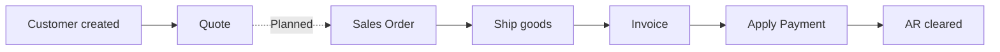
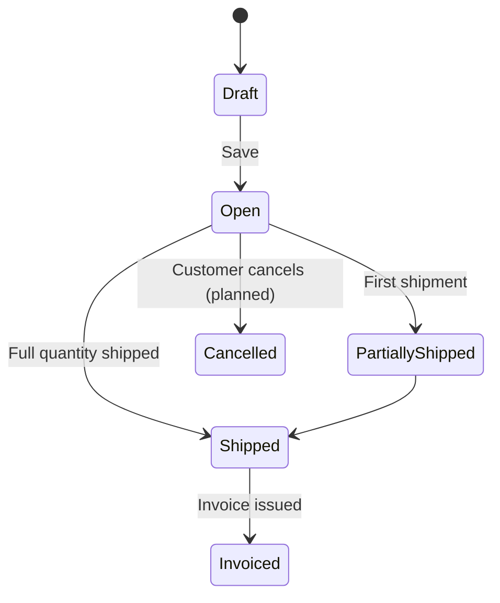
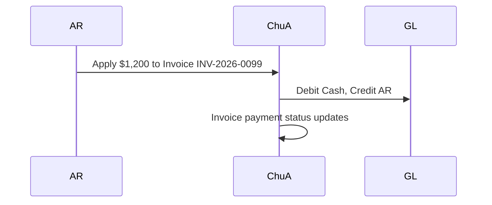

# Sales Module

> **Availability** — Available (Customers, Sales Orders, Invoices,
> Ship action, Apply-payment). Quotes are **Planned**.

## Table of Contents
- [Overview](#overview)
- [Who uses it](#who-uses-it)
- [Permissions](#permissions)
- [Customers](#customers)
- [Quotes](#quotes)
- [Sales Orders](#sales-orders)
- [Shipping](#shipping)
- [Invoices](#invoices)
- [Applying customer payments](#applying-customer-payments)
- [Returns](#returns)
- [Credit holds](#credit-holds)
- [Order tracking](#order-tracking)
- [Reports](#reports)
- [Worked scenarios](#worked-scenarios)
- [Common mistakes & validation rules](#common-mistakes--validation-rules)
- [FAQ](#faq)

## Overview

Sales handles the customer-facing half of the trading cycle: register
customers, take their orders, ship the goods, invoice them, and apply
their payments.

## Who uses it

| Role | Activities |
|---|---|
| **Sales Rep** | Create customers, raise sales orders |
| **Customer Service** | Update sales orders, answer customer queries |
| **Warehouse / Shipping** | Ship orders, record shipment details |
| **AR Clerk** | Issue invoices, apply customer payments |
| **AR Manager** | Approve invoices, oversee aging |
| **Credit Controller** | Set credit limits, place holds |

## Permissions

| Permission | Grants |
|---|---|
| `CustomerRead` | View customer list and details |
| `CustomerCreate` | Create customers |
| `CustomerUpdate` | Edit / deactivate customers |
| `SalesOrderRead` | View SOs |
| `SalesOrderCreate` | Create / edit / delete SOs |
| `SalesOrderShip` | Post shipments against SOs |
| `InvoiceRead` | View invoices |
| `InvoiceCreate` | Create / edit / delete invoices |
| `InvoiceApplyPayment` | Apply payments against invoices |

## Customers

### Customer record fields

| Field | Required | Notes |
|---|---|---|
| Customer code | ✓ | 1-40 chars; unique within company; immutable |
| Legal name | ✓ | 1-200 chars |
| Default currency | ✓ | 3-letter ISO; defaults to company base |
| Payment terms (days) | ✓ | 0-365 days |
| Credit limit | ✓ | Money (amount + currency); 0 means no credit |
| Blocked from new transactions | | Tick to prevent new SOs / invoices |

### Creating a customer

1. *Sales › Customers › New customer* (requires `CustomerCreate`).
2. Enter code, legal name, currency, terms, credit limit.
3. Click **Create**.

`[SCREENSHOT: New customer form]`

### Credit limits

The credit limit determines the maximum **outstanding receivable** the
customer is allowed to carry. The system warns (and, depending on tenant
config, blocks) the issue of new invoices that would push the customer
past the limit.

> **Tip** — Review credit limits at least annually, ideally after each
> trade reference / Dun & Bradstreet refresh.

### Blocking a customer

Use the **Blocked** flag for credit holds, disputes, or compliance freezes.
Blocked customers cannot have new SOs or invoices raised; existing ones are
unaffected.

## Quotes

> **Availability** — **Planned**.

Quotes will provide a pre-SO stage for proposing pricing to a customer
without committing inventory. Today, sales teams typically prepare quotes
outside the system and convert them to a Sales Order on customer acceptance.

## Sales Orders

A Sales Order (SO) is your **commitment to a customer**: order number,
date, currency, line items.

### SO record fields

| Field | Required | Notes |
|---|---|---|
| Customer | ✓ | Must not be blocked, must not exceed credit (warning / hard block per tenant config) |
| Order number | ✓ | Unique within company |
| Order date | ✓ | Defaults to today |
| Currency | ✓ | Defaults to customer's default |
| Lines | ✓ | At least one; item + qty + unit price |

### Creating an SO

1. *Sales › Sales Orders › New* — requires `SalesOrderCreate`.
2. Choose **Customer**.
3. Enter order number, date, currency.
4. Add lines: item, description override, quantity, unit price.
5. Click **Create**.

`[SCREENSHOT: Create SO form]`

### SO lifecycle

## Shipping

When the warehouse fulfils the SO:

1. Open the SO.
2. Click **Ship** (requires `SalesOrderShip`).
3. Fill the ship form:
   - Shipment date
   - Warehouse the goods leave from
   - Shipment number
   - Optional carrier and tracking number
   - For each line: shipped quantity
4. Click **Confirm shipment**.

`[SCREENSHOT: Ship sales order form]`

### Effects of a shipment

| Subsystem | Effect |
|---|---|
| Inventory | On-hand decreases at the chosen warehouse |
| SO | Status updates; lines mark how much has shipped |
| GL | Inventory → COGS posting (planned auto-post; today via manual JE) |
| Customer | Eligible for invoicing (or auto-invoice — planned) |

### Partial shipments

You can ship lines partially and post multiple shipments against the same
SO. Each shipment returns a shipment id that the system records.

## Invoices

### Invoice record fields

| Field | Required | Notes |
|---|---|---|
| Customer | ✓ | |
| Invoice number | ✓ | Unique within company |
| Invoice date | ✓ | The "as of" date |
| Due date | ✓ | Derived from terms but editable |
| Currency | ✓ | |
| Lines | ✓ | Description + qty + unit price |

### Creating an invoice

> **Note** — The current release lets you create invoices independently of
> SOs. Future releases (planned) will offer an *Invoice from SO* shortcut
> that copies the SO lines and links the invoice back to the SO.

1. *Sales › Invoices › New* — requires `InvoiceCreate`.
2. Choose customer, enter invoice number, dates, currency.
3. Add lines.
4. Click **Create invoice**.

`[SCREENSHOT: Create invoice form]`

### Invoice statuses

| Status | Meaning |
|---|---|
| Draft | Created but not yet sent / posted |
| Open | Sent to customer; AR posted |
| PartiallyPaid | Some payment received |
| Paid | Fully paid |
| Overdue | Past due date with outstanding balance |
| Cancelled | Voided |

Payment status follows the same Outstanding / PartiallyPaid / Paid pattern
as bills.

## Applying customer payments

When a customer's payment arrives (bank transfer, check, card, etc.):

1. Open the customer's invoice.
2. Click **Apply payment** (requires `InvoiceApplyPayment`).
3. Fill:
   - Payment date
   - Amount (defaults to outstanding)
   - Currency
   - Payment method
   - Reference (bank reference, check number, …)
4. Click **Confirm**.

`[SCREENSHOT: Apply customer payment form]`

### Effects of a payment

### Customer payments not tied to an invoice

> **Availability** — **Planned**.

For on-account / unmatched receipts, future support will let AR post a
credit to the customer's account and later apply it to specific invoices.
Today, post a journal entry to capture the receipt and apply manually
once you know which invoice it covers.

## Returns

> **Availability** — **Planned**.

Customer returns will:
- Issue a credit memo (negative invoice)
- Reverse inventory at the warehouse
- Either net against a future invoice or trigger a refund

Today, returns are handled with a manual journal entry plus an inventory
adjustment.

## Credit holds

The **credit limit** on the customer is checked when raising new invoices:

| Scenario | System behaviour |
|---|---|
| Outstanding ≤ Credit limit | Allowed |
| Outstanding + new invoice > Credit limit | Warning toast; tenant policy may block |
| Customer Blocked | Hard block on new SOs and invoices |

For tenants with stricter policy, ask your Company Admin to enable
*hard* credit holds (blocks instead of warns).

## Order tracking

The detail page of each SO shows current status and shipment history. For
customer-facing tracking, the carrier's tracking number you recorded on
the shipment can be shared.

> **Availability** — A **customer portal** for self-service tracking is
> **Planned**.

## Reports

| Report | Purpose |
|---|---|
| Customer Aging | Outstanding invoices by aging bucket |
| Open Sales Orders | SOs not yet fully shipped |
| Sales Order Status | All SOs with current state |
| Invoices Outstanding | Open AR snapshot |
| Top Customers by Revenue | Revenue concentration |
| Days Sales Outstanding (DSO) | (Planned) AR turnover metric |

## Worked scenarios

### Scenario 1 — End-to-end sale

1. *Sales › Customers › New* — Customer **C-220**, legal name *Acme Retail Group*, USD, Net 30, credit limit $50,000.
2. *Sales › Sales Orders › New* — Customer C-220, order **SO-2026-0317**, 50 × WidgetSKU @ $20 = $1,000.
3. *Ship* — From warehouse Main, shipment **SH-2026-0142** via FedEx, tracking `7890…`.
4. *Sales › Invoices › New* — Invoice **INV-2026-0099** mirroring the SO lines, due 30 days out.
5. Send invoice (PDF export planned; today email outside the system).
6. 28 days later customer pays via wire transfer.
7. *Apply payment* — $1,000 BankTransfer, reference `WT-2026-0617`.
8. Invoice closes; AR balance for Acme decreases; cash increases.

### Scenario 2 — Partial shipment + partial payment

1. SO for 100 units total.
2. Warehouse can only ship 60 today.
3. Post shipment for 60 units; SO status = PartiallyShipped.
4. Issue invoice for 60 × unit price (or wait until full shipment — tenant policy choice).
5. Customer pays 50% of the invoice.
6. Invoice status = PartiallyPaid; outstanding = remaining 50%.
7. Two weeks later remaining 40 units ship; new invoice for those 40.
8. Customer pays both invoices in full.

## Common mistakes & validation rules

| Mistake | Symptom | Fix |
|---|---|---|
| Customer code reused | Validation error | Use unique code |
| Currency mismatch on invoice vs customer | Allowed but flagged | Verify FX handling |
| Credit limit breach | Warning / block (tenant policy) | Adjust limit or insist on payment |
| Ship to wrong warehouse | Inventory imbalance | Cycle count + adjustment |
| Apply payment exceeding outstanding | Error | Reduce amount or split across invoices |
| Negative quantity on a line | Validation error | Use a credit memo / return process instead |

## FAQ

**Q: Customer paid more than the invoice. Where does the excess go?**
A: Today, post a journal entry to a "customer credit on account"
   liability account. Once on-account credits ship (planned), the excess
   can stay against the customer for later application.

**Q: A customer wants the invoice in their currency, not ours.**
A: Set the invoice currency to the customer's; the GL handles conversion
   to the company base currency.

**Q: I shipped to the wrong customer's address.**
A: The system records the warehouse you shipped *from*; the recipient
   address is stored externally (planned). Coordinate with the carrier
   to redirect or recover the shipment.

**Q: Customer disputes an invoice. What's the process?**
A: Set the invoice status to **Disputed** (planned). Today, add a comment
   on the invoice and flag the customer's account. Do not auto-apply
   future payments until resolved.

**Q: When does revenue post to the GL?**
A: On invoice posting. The next release auto-posts the GL entry when the
   invoice transitions from Draft to Open; today an accountant posts a
   journal entry manually if the rule isn't configured.
