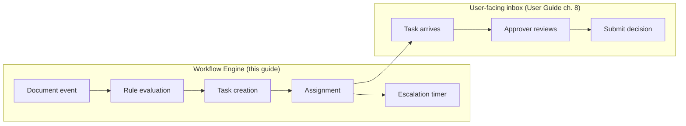
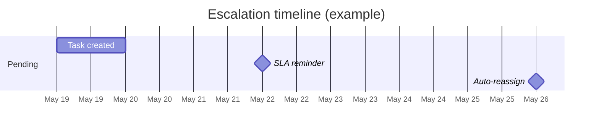

# Workflow Engine

> **Availability** — The runtime engine (task creation, routing,
> Submit, Reassign, status transitions) is **Available**. The
> *Workflow Rules admin UI* for configuring routing visually is
> **Planned**.

## Table of Contents
- [Overview](#overview)
- [Two halves of workflow](#two-halves-of-workflow)
- [Anatomy of an approval rule](#anatomy-of-an-approval-rule)
- [Routing strategies](#routing-strategies)
- [Approval limits and thresholds](#approval-limits-and-thresholds)
- [Escalation policies](#escalation-policies)
- [Delegation rules](#delegation-rules)
- [SLA tracking](#sla-tracking)
- [Configuring rules (admin)](#configuring-rules-admin)
- [Best practices](#best-practices)
- [FAQ](#faq)

## Overview

The Workflow Engine is what creates and routes the **approval tasks** that
show up in *Workflow › Approvals*. Where the *Workflow & Approvals*
chapter of the User Guide showed you how to **act on** tasks, this guide
explains how tasks are **created** — useful for managers and admins who
configure approval policy.

> **End users** — You don't need this chapter to do your job. Read
> [Workflow & Approvals](../user-guide/08-workflow-approvals.md) instead.
>
> **Managers and admins** — Read on.

## Two halves of workflow



The Engine is responsible for:
- Listening for trigger events (bill submitted, JE post requested, etc.)
- Evaluating routing rules to decide who should approve
- Creating one or more tasks
- Tracking SLA and escalation

The Inbox is the user-facing queue where approvers pick up tasks.

## Anatomy of an approval rule

A rule is a 4-tuple:

```
(Trigger, Condition, Approver, SLA)
```

| Part | Example |
|---|---|
| **Trigger** | "Bill submitted for approval" |
| **Condition** | "Total amount ≥ $5,000 AND vendor is not 'utility'" |
| **Approver** | "AP Manager role in same company" |
| **SLA** | "Pending → escalation in 3 business days" |

A rule can also be **sequential** (chain multiple approvers) or
**parallel** (require N approvers at once).

## Routing strategies

| Strategy | When to use |
|---|---|
| **By cost / amount** | Most common. Bigger transactions need higher approvers. |
| **By cost centre / department** | Each department approves its own spend. |
| **By account** | Sensitive GL accounts (capex, tax, related-party) get extra review. |
| **By vendor / customer tier** | Strategic counterparties get a different approver. |
| **By workflow event** | Period-close JEs go through controller; routine JEs don't. |
| **Round-robin** | Distribute tasks across a team to balance workload. |

### Combining strategies

Strategies stack. A bill might be routed by amount AND by cost centre:
- $4k Marketing bill → Marketing supervisor (cost centre)
- $80k Marketing bill → Marketing supervisor → Marketing director → CFO
  (cost centre + amount)

## Approval limits and thresholds

A typical limit ladder:

| Approver level | Authority |
|---|---|
| Supervisor | ≤ $5,000 |
| Manager | ≤ $25,000 |
| Director | ≤ $100,000 |
| VP / CFO | ≤ $500,000 |
| CEO / Board | > $500,000 |

Real organisations also have:
- **Sole sign-off limits** (one approver) vs **dual sign-off** at higher
  bands
- **Capex thresholds** (project capital expenditure) that may differ from
  opex
- **Currency normalisation** (limits stated in company base currency;
  transactions in other currencies are converted at the JE's exchange
  rate)

> **Tip** — Keep ladders simple. Five bands are usually enough; ten
> become unmanageable and audit hates exceptions.

## Escalation policies

The engine watches every Pending task. Two timers run:



- **Reminder SLA** — typically 3 business days. The assignee gets a
  reminder email and the task is highlighted on their queue.
- **Reassignment SLA** — typically 5 business days. The task auto-moves
  to the assignee's manager (per the org structure). Audit log records
  the auto-reassignment.

> **Note** — SLAs are tenant-configurable. A control-heavy organisation
> might set them lower (e.g. 1 day / 2 days); a low-volume one might
> raise them.

## Delegation rules

> **Availability** — Self-service delegation profiles are **Planned**.
> Today, delegation is achieved via manual reassignment.

Future delegation: any user with `WorkflowRead` can configure
"During Date Range → route my tasks to X" in their profile. The engine
honours active delegations when creating tasks.

## SLA tracking

Each task records:
- Time-to-first-action
- Time-to-resolution
- Whether SLA was breached
- Whether escalation fired

A **Workflow Performance** report (planned) aggregates these per role,
per rule, and per actor — useful for identifying bottlenecks.

## Configuring rules (admin)

> **Availability** — A graphical **Workflow Rules** admin UI is
> **Planned**. Today, rules are configured in tenant setup. To change
> them, contact your platform team with the desired matrix.

A rule definition contains:

| Field | Example |
|---|---|
| Name | "Bills $5k–$25k → AP Manager" |
| Subject type | `Bill` |
| Trigger event | `SubmittedForApproval` |
| Condition (expression) | `subject.totalAmount.amount >= 5000 && subject.totalAmount.amount < 25000` |
| Approver(s) | `role:ApManager AND company:subject.companyId` |
| Mode | Sequential |
| Reminder SLA | 3 business days |
| Escalation SLA | 5 business days |
| Escalation target | `subject.assignee.manager` |

Rules are versioned. Changing a rule does **not** retroactively re-route
tasks that are already in-flight; they continue under the rule version
that was active when they were created.

## Best practices

- **Document your approval policy outside the system too.** Compliance
  auditors want to see a written policy, not just the rule list.
- **Don't route everything to the CFO.** Build a real ladder.
- **Review escalation reports monthly.** Frequent escalations signal an
  understaffed or overloaded approver.
- **Test rule changes in UAT** before production. Mis-routing can hide
  bills from approvers for days.
- **Avoid circular delegation.** If Alice delegates to Bob and Bob
  delegates to Alice, the engine refuses to route (planned).
- **Limit `WorkflowApprovalSubmit`** to staff who actually own decisions.
  Read access is broader; submit access is narrower.

## FAQ

**Q: I changed the approval threshold; will pending tasks re-route?**
A: No. In-flight tasks continue under their original rule. New tasks
   use the updated rule. If you need to force re-route, Reassign manually.

**Q: Can an approver approve their own submission?**
A: The engine refuses to create a task assigned to the submitter
   (segregation of duties). If your role catalogue allows the same person
   to occupy both roles, configure an alternate approver.

**Q: How do I see who approves what before submitting?**
A: For bills and POs, the workflow rules list (planned admin screen)
   shows the routing tree. Today, talk to your Company Admin or check
   the policy document.

**Q: A task auto-escalated but should not have. How do I un-escalate?**
A: Manual reassignment moves it back. The auto-escalation event remains
   in the audit log; that's by design.

**Q: Can we have country-specific approval rules?**
A: Yes — rules can be conditional on `subject.companyId` if your tenant
   models each country as a separate company. Talk to your account team
   about regional approval matrices.
