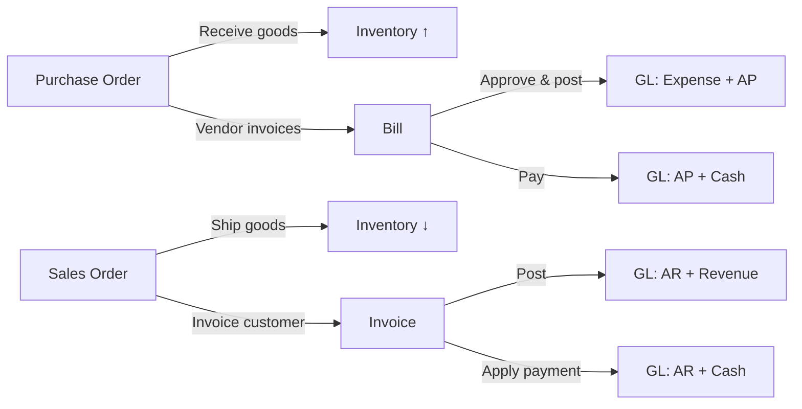

# 1. Introduction

## Table of Contents
- [What is ChuA.ERP?](#what-is-chuaerp)
- [Why an integrated ERP?](#why-an-integrated-erp)
- [Supported departments](#supported-departments)
- [Major modules](#major-modules)
- [User roles at a glance](#user-roles-at-a-glance)
- [Benefits](#benefits)
- [How this manual is organised](#how-this-manual-is-organised)

## What is ChuA.ERP?

ChuA.ERP is an enterprise resource planning system that unifies your company's
**accounting, purchasing, sales, inventory and approvals** in a single
browser-based application. It replaces the spreadsheets, departmental
sub-systems and email approval chains that grow up around mid-size finance
operations and gives every department a shared, real-time view of the same
data.

In the day-to-day, ChuA.ERP is where staff:
- Register new vendors and customers
- Raise purchase orders and receive goods
- Enter bills, approve them, and pay them
- Issue invoices and apply customer payments
- Maintain the chart of accounts and post journal entries
- Manage on-hand inventory across warehouses
- Process approval requests and reassign tasks
- Run financial and operational reports

## Why an integrated ERP?

Because every business process touches accounting eventually.

When purchasing, sales, and inventory each run on their own systems, the
controller's team spends days reconciling them at month-end. An integrated ERP
removes that work by ensuring **every transaction posts to the general ledger
the moment it is approved** — and that no inventory movement, no bill payment,
and no customer receipt happens without a corresponding ledger entry.

## Supported departments

| Department | Primary modules | Typical activities |
|---|---|---|
| **Finance** | Chart of Accounts, Journal Entries, Reports | Period close, reconciliations, financial reporting |
| **Accounts Payable** | Vendors, Bills, Workflow | Bill entry, approvals, vendor payments |
| **Accounts Receivable** | Customers, Invoices, Workflow | Invoicing, collections, payment application |
| **Purchasing** | Vendors, Purchase Orders, Workflow | PO creation, approvals, goods receipt |
| **Sales** | Customers, Sales Orders, Invoices | Order entry, shipment, customer accounts |
| **Warehouse / Inventory** | Inventory, Purchase Orders, Sales Orders | Receive, ship, adjust, stock takes |
| **Operations & approvers** | Workflow | Review and decide on pending approval tasks |
| **Executive / management** | Dashboard, Reports | KPI monitoring, cross-functional reporting |
| **System Administration** | Companies, Users, Roles, Health | Tenant setup, user lifecycle, access control |

## Major modules

| Module | Available | Description |
|---|---|---|
| Vendors | ✓ | Master data for suppliers — codes, names, payment terms, currency, blocked status |
| Customers | ✓ | Master data for customers — codes, names, payment terms, credit limits, blocked status |
| Chart of Accounts | ✓ | The general-ledger account hierarchy |
| Journal Entries | ✓ | Manual GL postings (draft + post lifecycle) |
| Bills | ✓ | Vendor invoices with approval, payment and outstanding-balance tracking |
| Invoices | ✓ | Customer invoices with payment application |
| Purchase Orders | ✓ | Order to supplier with line items, approval, and goods-receipt tracking |
| Sales Orders | ✓ | Order to customer with line items, ship action |
| Inventory | ✓ | Stocked items, warehouse balances, manual adjustments |
| Workflow / Approvals | ✓ | Approval tasks across documents (Submit, Reassign) |
| Reports | ✓ | Run named reports with parameters |
| CRM (Leads, Opportunities) | Planned | See [CRM module](../modules/crm.md) for roadmap |
| Cycle Counts, Lot/Serial Tracking | Planned | See [Inventory module](../modules/inventory.md) |
| Bank Reconciliation | Planned | See [Finance module](../modules/finance.md) |

## User roles at a glance

ChuA.ERP uses **role-based access control**. Most users belong to one or more
named roles; each role grants a set of permissions. The two organisation-wide
administrative roles are:

| Role | Granted by | Typical responsibilities |
|---|---|---|
| **System Admin** | Platform team | Cross-tenant configuration, company onboarding, user lifecycle |
| **Company Admin** | System Admin | Manage users, roles and permissions inside one company |

Beyond those, your tenant defines functional roles (e.g. *AP Clerk*, *AP Manager*, *Buyer*,
*Sales Rep*, *Warehouse Supervisor*, *Controller*) that map to specific
permissions like `BillRead`, `BillApprove`, `PurchaseOrderCreate`, etc. See
[Security & Permissions](../admin/security-permissions.md) for the full list.

## Benefits

- **Single source of truth.** Every transaction posts back to the GL — no
  parallel sub-ledgers to reconcile.
- **Approval discipline.** Bills, purchase orders, and journal entries follow a
  configurable approval chain that is recorded with the document.
- **Audit ready.** Every change carries an immutable timestamp, the actor's
  identity, and a correlation id that links UI actions to server-side records.
- **Browser-based.** No client software to deploy; users sign in from any
  modern browser.
- **Multi-tenant.** One installation can host multiple legal entities; users
  with rights to more than one company can switch between them.
- **Enterprise security.** OpenID Connect / SSO integration, JWT bearer
  authentication, automatic session expiry, optional MFA via the identity
  provider, and granular policy-based authorisation.
- **Reportable.** Built-in reports can be exported to Excel, CSV, or PDF; any
  list view supports search and filtering.

## How this manual is organised

The remaining chapters of the **User Guide** cover features every user needs
regardless of role:

| Chapter | Topic |
|---|---|
| 2 | Getting Started — browser support, accounts, password policy |
| 3 | Logging In — sign-in, MFA, password reset, session timeout |
| 4 | Navigation — sidebar, breadcrumbs, search |
| 5 | Dashboard — widgets, KPIs, drill-down |
| 6 | User Profile & Preferences |
| 7 | Notifications |
| 8 | Workflow & Approvals |
| 9 | Reports & Exports |
| 10 | Search & Filtering |
| 11 | Attachments & Documents |
| 12 | Audit History |

The **Module Guides** then go deep on each functional area
(Purchasing, Sales, Inventory, Finance, CRM, Workflow). Reference material
(Troubleshooting, FAQ, Glossary, Role-Based Guides) sits at the back of the
manual for quick look-up.
