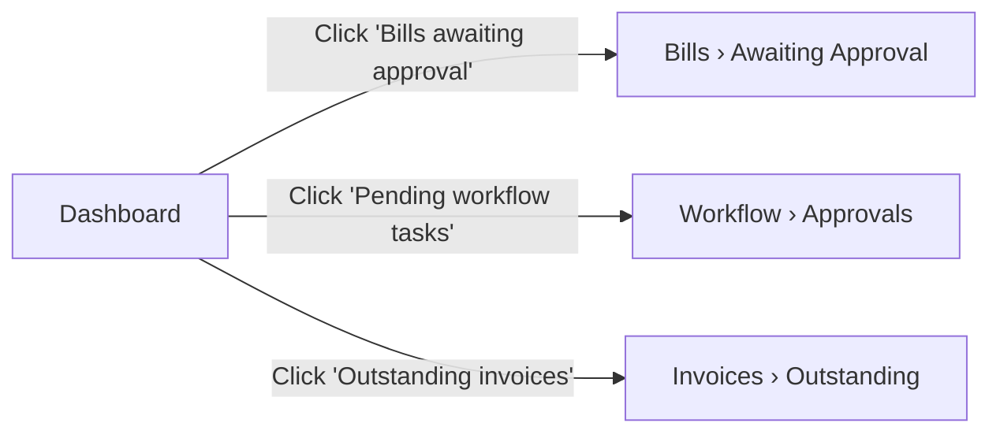

# 5. Dashboard

## Table of Contents
- [Purpose](#purpose)
- [Default layout](#default-layout)
- [KPI tiles](#kpi-tiles)
- [Drill-down](#drill-down)
- [Health banner](#health-banner)
- [Role-specific dashboards](#role-specific-dashboards)
- [Customisation](#customisation)
- [Refresh behaviour](#refresh-behaviour)
- [Frequently asked questions](#frequently-asked-questions)

## Purpose

The Dashboard is the landing page after sign-in. It gives every user a
**single-glance summary of items that need attention**: bills awaiting
approval, workflow tasks pending decision, outstanding receivables — and a
heads-up if the API backend is unreachable.

Each tile is **clickable**: tapping it drills into the underlying list with
the same filter applied.

## Default layout

```
+-----------------------------------------------------------+
| Welcome, Alice                                            |
|                                                           |
| [⚠ Some API calls failed — check System Health.]          |   ← optional banner
|                                                           |
| +-------------+   +-------------+   +-------------+       |
| |     12      |   |      3      |   |     27      |       |
| | Bills       |   | Pending     |   | Outstanding |       |
| | awaiting    |   | workflow    |   | invoices    |       |
| | approval    |   | tasks       |   |             |       |
| +-------------+   +-------------+   +-------------+       |
|                                                           |
| Active company: 00000000-0000-0000-0000-000000000c01      |
+-----------------------------------------------------------+
```

`[SCREENSHOT: Dashboard with three KPI tiles]`

## KPI tiles

The three default tiles cover the most common attention-needing inboxes:

| Tile | Source | Drill-down |
|---|---|---|
| **Bills awaiting approval** | All bills in status "Submitted" / "PendingApproval" across vendors | *Purchasing › Bills › Awaiting Approval* filter |
| **Pending workflow tasks** | All workflow approval requests assigned to the current user in status "Pending" | *Workflow › Approvals* with status filter |
| **Outstanding invoices** | All customer invoices with payment status "Outstanding" or "PartiallyPaid" | *Sales › Invoices* with paymentStatus filter |

Each tile shows:
- A large number — the count of items
- A description
- Colour-coded background (yellow = warning workload, blue = informational, etc.)

> **Tip** — A tile showing **0** means nothing currently needs your
> attention in that category. A tile showing a large number that is **not
> decreasing** over days may indicate a process bottleneck — flag it to your
> manager.

## Drill-down

Click any tile to be taken to a pre-filtered list page:



From the drill-down list page you can:
- Open any record by clicking its number/code
- Apply additional filters (date range, vendor, customer, etc.)
- Export the filtered set to Excel via the export action (where available)

## Health banner

If any of the three tile-loading API calls fails, a yellow banner appears at
the top of the Dashboard:

> ⚠ Some API calls failed; tile values may be stale. Check **System Health**.

This is your earliest signal that the backend is degraded. Click *System
Health* (in the **System** section of the sidebar) for the API status and
the timestamp of its most recent response.

## Role-specific dashboards

Today the Dashboard shows the same three tiles to every user. Role-specific
dashboards are on the roadmap — the **Availability** in each row below tells
you what is shipped vs planned.

| Dashboard variant | For role | Availability |
|---|---|---|
| **Default (operational)** | All users | Available |
| **Finance dashboard** | Controller, Accountant | Planned — period close progress, GL trial balance summary, unposted journal count |
| **Purchasing dashboard** | Buyer, AP Manager | Planned — open POs by vendor, receipts pending invoice match, top spend by category |
| **Sales dashboard** | Sales Rep, Sales Manager | Planned — open SOs, ready-to-ship, top customers by AR balance |
| **Executive dashboard** | C-level, board | Planned — revenue, AP/AR aging, cash position, headline KPIs |
| **Inventory dashboard** | Warehouse Supervisor | Planned — stock-out risks, slow movers, cycle count completion |

Until role dashboards ship, you can compose the same view by:
1. Pinning module list pages as browser bookmarks
2. Running scheduled reports (see [Reports & Exports](09-reports-exports.md))
3. Using the per-module list pages with saved filters

## Customisation

> **Availability** — Tile reordering and user-defined widgets are **Planned**.

In the current release the tiles, their order, and the data they show are
fixed. The next release introduces:
- Drag-and-drop tile arrangement
- Per-tile preferences (date range, status filter)
- Adding/removing tiles from a library
- Sharing dashboard layouts with colleagues

## Refresh behaviour

The Dashboard fetches its data **at page load**. Numbers are point-in-time;
to see updates after someone else approves a bill or pays an invoice, refresh
the page (browser refresh or revisit the Dashboard from the sidebar).

> **Tip** — Auto-refresh is intentionally off. In an enterprise environment
> with hundreds of users, polling every 30 seconds creates noisy load on the
> API. Use a manual refresh when you genuinely need an update.

## Frequently asked questions

**Q: My Dashboard shows 0 across all tiles but I know there are pending items.**
A: Confirm you are signed in to the correct company (top-right user menu →
   *Switch company*). KPIs are scoped to your active company.

**Q: Why don't I see the Purchasing dashboard described in your training video?**
A: Role-specific dashboards are on the roadmap. The current release ships
   the universal operational dashboard. Talk to your account team about
   the dashboard release.

**Q: A tile is stuck on the same number for days.**
A: Either: (a) nothing has changed (likely if it's a small queue), or (b) the
   underlying workflow has stalled. Open the tile and inspect the oldest
   record — if it is more than a few days old, talk to the owner or escalate.

**Q: A tile shows a much higher number than I expect.**
A: You may be in a different company than usual. Check the top-right menu.

**Q: The Dashboard is slow to load.**
A: Each tile makes one API call. If the backend is degraded, the page waits
   for the slowest call before rendering. Check the yellow banner; if it
   appears, the System Health page will tell you which dependency is slow.
