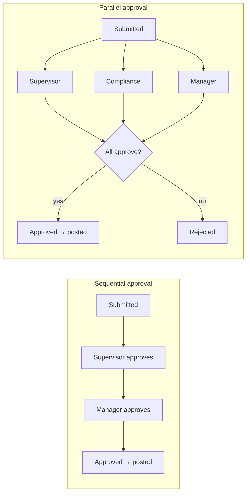
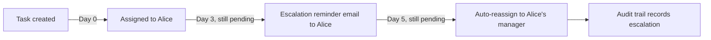
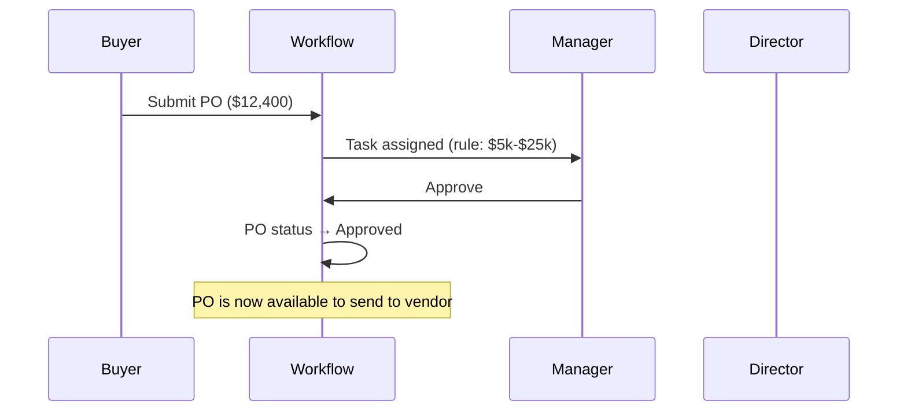
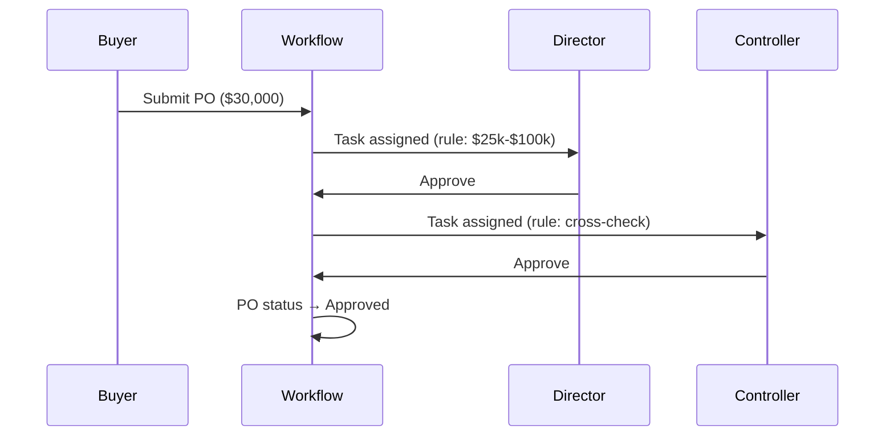

# 8. Workflow & Approvals

## Table of Contents
- [What is a workflow approval?](#what-is-a-workflow-approval)
- [Approval queues](#approval-queues)
- [Approval routing](#approval-routing)
- [Sequential vs parallel approval](#sequential-vs-parallel-approval)
- [Approving a task](#approving-a-task)
- [Rejecting a task](#rejecting-a-task)
- [Reassignment](#reassignment)
- [Delegation](#delegation)
- [Escalation](#escalation)
- [Workflow comments](#workflow-comments)
- [Approval history](#approval-history)
- [Worked examples](#worked-examples)
- [Best practices](#best-practices)

## What is a workflow approval?

When someone submits a document that requires sign-off — a bill, a purchase
order, a journal entry, a credit-limit change — ChuA.ERP **does not let it
post until an approver decides on it**. The system creates a workflow task,
routes it to the right people, and records every comment and decision against
the source document.

Approvals serve three enterprise goals:
1. **Segregation of duties.** The person who enters a transaction cannot
   approve it.
2. **Audit trail.** Every decision is timestamped with the actor's identity.
3. **Compliance.** Internal control reviews can prove that no high-value
   transaction passed unchallenged.

> **Permission required** — To see and act on tasks you need `WorkflowRead`.
> To submit a decision you also need `WorkflowApprovalSubmit`.

## Approval queues

Your queue lives at *Workflow › Approvals* in the sidebar.

`[SCREENSHOT: Workflow › Approvals list with filters]`

| Column | Meaning |
|---|---|
| Subject type | Bill, PurchaseOrder, JournalEntry, etc. |
| Subject id | The id of the document |
| Requested by | Who triggered the approval |
| Requested at | When the task was created |
| Required approvals | How many approvers are needed |
| Status | Pending · Approved · Rejected · Cancelled |

Filter by **Status** (default = Pending) and **Subject type** to narrow the
list. The Dashboard tile *Pending workflow tasks* deep-links here pre-filtered
to your queue.

## Approval routing

Routing is configured by your Company Admin in the workflow engine (see the
[Workflow Engine module](../modules/workflow-engine.md)). Common patterns:

| Pattern | Used for | Example |
|---|---|---|
| **Hierarchy by amount** | Bills, POs | $0 – $5k → supervisor · $5k – $50k → manager · $50k+ → controller |
| **Single approver per cost centre** | Departmental purchases | Marketing PO routes to Marketing manager |
| **Two-eyes principle** | Journal entries | Preparer + reviewer; reviewer cannot be preparer |
| **Compliance review** | Customer credit changes | Sales manager + finance director (parallel) |

Routing decisions are recorded on each task; you can see which rule produced
your assignment on the task detail page.

## Sequential vs parallel approval



- **Sequential**: each step waits for the previous to complete. Default for
  cost-based hierarchy (you can't get manager sign-off until supervisor signs).
- **Parallel**: all approvers see the task at the same time. The document
  advances only when every approver has signed off, OR is rejected when any
  approver rejects.

You can tell which mode applies by looking at *Required approvals* on the
task — a value of 1 with a sequential rule is sequential; a value of N where
N parallel approvers are notified is parallel.

## Approving a task

1. Open *Workflow › Approvals*.
2. Click a row to open the task detail.
3. Review the **subject** — there is a direct link to the underlying document
   (the bill, the PO, the journal entry).
4. Read the **comments** from previous approvers (if any).
5. Click **Submit decision**.
6. Choose **Approve** as the decision.
7. Optionally add a **comment** — your justification, conditions, or context.
8. Click **Confirm**.

`[SCREENSHOT: Submit decision page with Approve selected]`

> **Tip** — Always add a comment when approving items above $10k. The
> comment is what auditors look for next year when they ask "why did you
> approve this?"

## Rejecting a task

1. Same path as approval, choose **Reject** instead.
2. Comment is **strongly recommended**, often required by tenant policy:
   explain what is wrong and what the submitter should change.
3. Click **Confirm**.

When you reject, the task closes and the source document returns to **Draft**
status. The submitter is notified (email and Dashboard) and can edit + resubmit.

> **Warning** — Rejection is not a soft "send back for clarification" — it
> resets the document. If you want clarification but not a full resubmit,
> use a comment without a decision (see [Workflow comments](#workflow-comments)).

## Reassignment

Use reassignment when:
- A task landed on you in error
- You will be on leave; redirect to your delegate
- A different department owns this decision

To reassign:

1. Open the task.
2. Click **Reassign**.
3. Choose the **new assignee** (must be someone with the right to approve
   this subject type).
4. Add a **reason** — appears in the audit trail.
5. Click **Confirm**.

`[SCREENSHOT: Reassign form]`

The task moves to the new assignee's queue. **You no longer see it on the
Dashboard.** Both you and the new assignee receive email confirmation.

> **Permission required** — Reassignment uses the same `WorkflowRead`
> permission needed to view tasks. Your Company Admin can restrict
> reassignment in tenant configuration if your policy requires it.

## Delegation

> **Availability** — Self-service delegation profiles (e.g. "while I'm on
> leave from May 20 to May 27, send my approvals to Bob") are **Planned**.

Today, the manual workaround is:
1. Before going on leave, **email** your delegate listing pending tasks.
2. When tasks arrive during your absence, the delegate uses **Reassign** to
   move them to themselves.
3. When you return, reassign anything pending back to you.

Once the delegation feature ships, you will be able to set a date-bounded
delegation rule from your profile page, and the workflow engine will
auto-reassign new tasks for the duration.

## Escalation

If a task sits in **Pending** longer than the tenant-configured escalation
SLA (typically 3 business days), the workflow engine raises an **escalation
event**:



Escalation:
- **Logs an entry** on the task showing the SLA breach
- **Emails the original assignee + their manager** to act
- After a second SLA breach, may **auto-reassign** to the manager

Escalation thresholds and behaviour are tenant-configurable; ask your
Company Admin for your tenant's exact rules.

> **Tip** — If you anticipate not being able to approve in time, **reassign
> proactively**. Escalation is a backstop, not a normal flow — it generates
> audit noise that auditors will question.

## Workflow comments

Comments are first-class:
- Visible to **every approver** and the submitter
- **Immutable** — once posted you cannot edit or delete (only follow up with
  another comment)
- Recorded with the actor's identity and timestamp
- Auditable

Add a comment without submitting a decision when you want to:
- Ask the submitter for clarification
- Loop in a colleague to look at the document
- Note conditions ("approving subject to receiving the signed vendor MSA")

> **Availability** — Free-form comments attached to a task (independent of
> Submit / Reassign) are **Planned**. Today, comments are entered as part of
> Submit (Approve / Reject) or Reassign. The roadmap adds standalone
> commenting.

## Approval history

The bottom of every task detail page shows the **history**:

```
v Approval history
+------------------------------------------------------------+
| 2026-05-19 09:14  Alice Smith        Submit · Approve      |
|                                       "Approved per April   |
|                                        capex plan."          |
+------------------------------------------------------------+
| 2026-05-18 16:30  Bob Manager        Reassign · to Alice   |
|                                       "On leave — handing    |
|                                        to Alice."            |
+------------------------------------------------------------+
| 2026-05-18 11:02  System             Created                |
|                                       Routed by rule        |
|                                       'Bills > $5k'         |
+------------------------------------------------------------+
```

Each entry is **immutable**. The same trail is preserved with the source
document, so opening the bill (or PO, etc.) and scrolling to *Approval
history* shows the same content — handy when auditors are reviewing posted
transactions and don't want to navigate to the workflow module.

See [Audit History](12-audit-history.md) for how to query history across
the system.

## Worked examples

### Example 1 — Purchase Order approval



If the same PO were $30,000:



### Example 2 — Bill approval

```
Bill created (Status = Draft)
  ↓ submitter clicks Approve action on the bill (or Workflow processes a submission)
Task created in Workflow (Status = Pending)
  ↓ AP Manager opens the task in Workflow › Approvals
  ↓ Reviews underlying bill (vendor, amount, due date, line items)
  ↓ Submits decision = Approve
Workflow approves the task (Status = Approved)
  ↓ Bill status updates to "Approved"
  ↓ Bill is now eligible for Pay action
```

If rejected, the bill returns to **Draft** and the submitter is notified.

### Example 3 — Journal Entry approval

```
JE created in Draft status by Accountant
  ↓ Accountant clicks Post action (or workflow Submit)
Task created — reviewer required (two-eyes rule)
  ↓ Reviewer opens the JE
  ↓ Verifies debits = credits, account selections, period
  ↓ Approves
JE status → Posted, GL is updated
```

If the reviewer rejects, the JE returns to Draft and the accountant edits +
resubmits.

## Best practices

- **Open the source document** before approving. The task summary shows the
  basics; the document shows lines, attachments, and history.
- **Add comments on high-value decisions**. Future-you and the auditor will
  thank you.
- **Reassign promptly when you cannot act**. Letting tasks expire to
  escalation is noise.
- **Triage daily** — even a quick "open queue, approve obvious, reject one,
  reassign one" keeps the queue healthy.
- **Use the Dashboard tile** to gauge backlog at a glance.
- **Never approve your own submissions.** The system blocks it where it can,
  but cross-submitter approvals (signed in as a different account) are a
  control violation.
