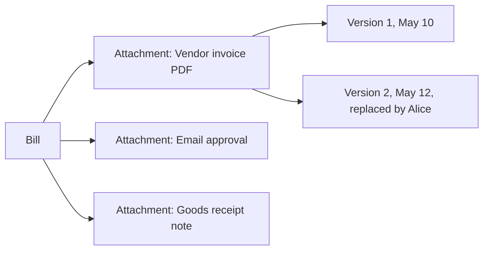

# 11. Attachments & Documents

## Table of Contents
- [Overview](#overview)
- [What you can attach today](#what-you-can-attach-today)
- [Roadmap](#roadmap)
- [File-handling policy](#file-handling-policy)
- [Best practices in the interim](#best-practices-in-the-interim)
- [Auditability of external attachments](#auditability-of-external-attachments)

## Overview

In an enterprise ERP, *attachments* are the source documents that support a
transaction — the scanned vendor invoice that backs a bill in the system,
the signed approval email for a journal entry, the bill of lading for a
shipment, the contract for a customer credit-limit increase.

Treating attachments as **first-class document objects** is on the
ChuA.ERP roadmap. This chapter documents the **planned** behaviour so users
and admins can plan around it, and provides interim guidance for the
current release.

## What you can attach today

> **Availability** — In-product attachment upload is **Planned**.

The current release does **not** ship in-product attachment storage. The
*Bills*, *Invoices*, *Purchase Orders*, *Sales Orders*, and *Journal
Entries* detail pages do not yet have an Attachments tab.

For the moment, treat attachments as **external links**:
- Store the scanned source in your tenant's existing document store
  (SharePoint, OneDrive, S3, Drive, Box, etc.)
- Put a stable URL to the attachment in the **Reference** field of the
  document (Bills, Invoices, Journal Entries all have one)
- Mention the location in your approval comment for traceability

## Roadmap

The planned attachment model:

| Feature | Description |
|---|---|
| Drag-and-drop upload | On any document detail page, drop a file to attach |
| Multi-file upload | Add several files at once |
| Inline preview | PDFs and images previewable without download |
| Version history | Replacing an attachment keeps prior versions, with the actor and date recorded |
| Permission inheritance | Attachments inherit the read permission of the parent document — if you can see the bill you can see its scan |
| Mandatory categories | Tenant admins can require *Vendor invoice PDF* on Bills > $5k, etc. |
| Virus scanning | Files are scanned on upload; unsafe files are quarantined |
| Retention policy | Attachments older than tenant-configured retention are auto-archived to cold storage |



## File-handling policy

When attachments ship, the platform will enforce:

| Rule | Default |
|---|---|
| Maximum file size | 25 MB per file |
| Maximum files per document | 20 |
| Allowed file types | PDF, JPG, PNG, TIFF, DOCX, XLSX, MSG, EML, ZIP |
| Disallowed file types | EXE, MSI, BAT, DLL, JS, HTML and other executables |
| Virus scanning | Yes (engine TBD per tenant) |
| Retention | 7 years by default; configurable per tenant |

> **Warning** — Never store payment card numbers (PAN), passwords, or
> private keys as attachments. The platform is not certified for storage
> of cardholder data; use a dedicated payment processor.

## Best practices in the interim

Until attachments ship, follow these conventions to keep audit trails
intact:

1. **Save the source document** to your tenant's document store with a
   structured file name:
   ```
   2026-05-15_Bill_B-2026-0142_AcmeCorp_VendorInvoice.pdf
   ```
2. **Put the canonical URL** to the file in the document's `Reference`
   field. Use a stable URL — short-lived presigned links break later.
3. **Mention the location** in your approval comment if the approver needs
   to inspect the source:
   ```
   Approved. Source PDF: \\fileshare\AP\2026\05\B-2026-0142.pdf
   ```
4. **For Journal Entries with manual adjustments**, include the calculation
   spreadsheet path in the Memo field and a one-line summary in the
   Reference field.
5. **For Inventory adjustments**, include the cycle-count report id or the
   damage incident number in the Reason field.

## Auditability of external attachments

Because the source documents live outside ChuA.ERP, the audit trail is
**indirect**:
- ChuA.ERP records the Reference field that points to the file
- Your document store records when the file was uploaded, by whom, and
  who has read it

For audit reviews, give auditors **read** access to your document store
and the ChuA.ERP reference field together. Once in-product attachments
ship, both halves of the trail live in ChuA.ERP itself.

> **Tip** — If your industry is regulated (financial services, healthcare,
> public sector), check with your compliance team whether external
> attachments satisfy your audit requirements. Some standards (e.g. SOX
> control sections) prefer integrated storage with locked retention.
